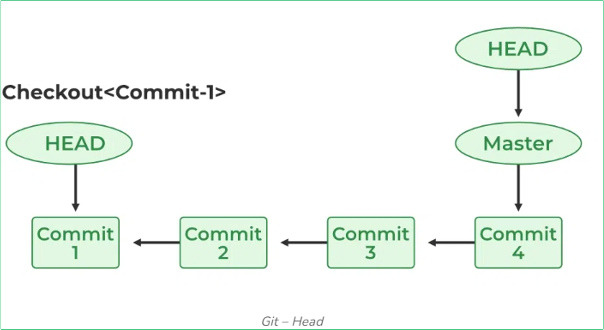

# Git: A Hands-on Intro

## Git Basics

### What is Git?

You can think of Git as a sort of "time machine" for your code. It allows you to go back in time and see what your code looked like at a certain point in time. It also allows you to see who made what changes to the code, and when. It even allows you to undo changes that you made to your code.

### Terminology

#### Repository

A Git repository, often referred to as a "repo", is a storage space where your project lives. It can be local storage on your computer, or it can be a remote storage on a service like GitHub or another online host. The repository is used to track changes in the project, coordinate work among multiple people, and track the project's history.

Say, you have a directory on your computer that contains all the files of your project. When you init a Git repository in that directory, Git creates a hidden subdirectory named `.git` where all the information about the repository is stored. This includes the history of all the changes that were made to the repository, as well as the current state of the repository.

#### Commit

Think of a commit as a snapshot of your repository at a certain point in time. A commit only carries information about the changes that were made to the repository since the last commit. It doesn't contain the entire repository (unless it's a first commit). So, each commit is a small piece of the repository's history, based on a previous commit. They all are linked together in a chain, forming a timeline of the repository's history.

#### Branch

A branch is a parallel version of a repository. It allows you to work on a new feature of your project without affecting the main version of the project. Once you are done working on the new feature, you can merge the branch back into the main version of the project.

## Creating a Project: Our First HTML Page ;)

<strong>Goals</strong>

- Learn how to create a Git repository from scratch.

### Create a "Hello, World!" page

Get started in an empty directory (for example, `repositories`, if you downloaded the file from the previous step) and add an empty subdirectory named `work`, then create a `hello.html` file in it with the following contents.

Run:

```bash
mkdir work
cd work
touch hello.html
```

Save the following content to `hello.html`:

```html
Hello, World!
```

## Create a repository

So you have a directory that contains one file. Run `git init` in order to create a Git repo from that directory.

```bash
git init
```

## Add the page to the repository

Now let's add the "Hello, World" page to the repository.

Run:

```bash
git add hello.html
git commit -m "Initial Commit"
```

## Checking the Status

Use the `git status` command to check the current state of the repository.

```bash
git status
```

> ℹ️ <strong>Note</strong> <br>
> If you see `On branch master` instead of `On branch main` after running the previous command, it means that you have a slightly older version of Git, which didn't understand us when we asked to set the default branch name to `main`. In this case, you can rename the branch name to `main` with the following command:
>
> ```bash
> git branch -m master main
> ```

## Making Changes

Let's add some HTML tags to our greeting. Change the file contents to:

```html
<h1>Hello, World!</h1>
```

Check the working directory's status:

```bash
git status
```

The first important aspect here is that Git knows the `hello.html` file has been changed, but these changes are not yet committed to the repository.

Another aspect is that the status message hints about what to do next. If you want to add these changes to the repository, use `git add`. To undo the changes use `git checkout`.

## Staging Changes

<strong>Goals</strong>

- Learn to stage changes for the upcoming commits.

### Adding changes

Now command Gtit to stage changes. Check the status:

```bash
git add hello.html
git status
```

Changes to the hello.html have been staged. This means that Git knows about the change, but it is not permanent in the repository. The next commit will include the changes staged.

Should you decide not to commit the change, the `status` command will remind you that you can use the git reset command to unstage these changes.

### Staging and Committing

Suppose you have edited three files (`a.html`, `b.html`, and `c.html`). After that you need to commit all the changes so that the changes to `a.html` and `b.html` were a single commit, while the changes to `c.html` were not logically associated with the first two files and were done in a separate commit.

In theory, you can do the following:

```bash
git add a.html
git add b.html
git commit -m "Changes for a and b"
```

```bash
git add c.html
git commit -m "Unrelated change to c"
```

Separating staging and committing, you get the chance to easily customize what goes into a commit.

## Committing Changes

<strong>Goals</strong>

- Learn to commit to the repository.

Well, enough about staging. Let's commit the staged changes to the repository.

When you previously used `git commit` for committing the first `hello.html` version to the repository, you included the `-m` flag that gives a comment on the command line. The `commit` command allows interactively editing comments for the commit. And now, let's see how it works.

If you omit the `-m` flag from the command line, Git will pop you into the editor of your choice from the list (in order of priority):

- `GIT_EDITOR` environment variable;
- `core.editor` configuration setting;
- `VISUAL` environment variable;
- `EDITOR` environment variable.

## Git inner working: Changes, not files

<strong>Goals</strong>

- Understanding that Git works with the changes, not the files.

Most version control systems work with files. You add the file to source control and the system tracks changes from that moment on.

Git concentrates on the changes to a file, not the file itself. A `git add file` command does not tell Git to add the file to the repository, but to note the current state of the file for it to be committed later.

### First Change: Adding default page tags

Change the "Hello, World" page so that it contains the default tags `<html>` and `<body>`:

```html
<html>
  <body>
    <h1>Hello, World!</h1>
  </body>
</html>
```

### Add this change

Now add this change to the Git staging:

```bash
git add hello.html
```

### Second change: Add the HTML headers

Now add the HTML headers(`<head>` section) to the "Hello, World" page:

```html
<html>
  <head></head>
  <body>
    <h1>Hello, World!</h1>
  </body>
</html>
```

### Check the current status

Run:

```bash
git status
```

Please note that `hello.html` is listed in the status twice. The first change (the addition of default tags) is staged and ready for a commit. The second change (adding HTML headers) is unstaged. If you were making a commit right now, headers would not have been saved to the repository.

Let's check.

### Commit

Commit the staged changes (default values), then check the status one more time.

```bash
git commit -m "Added standard HTML page tags"
git status
```

The `status` command suggests that `hello.html` still has unrecorded changes, but the staging area is already clear.

### Adding the second change

Add the second change to the staging area, after that run the `git status` command.

```bash
git add .
git status
```

### Commit the second change

Run:

```bash
git commit -m "Added HTML header"
```

> ℹ️ <strong>Note</strong> <br>
> We have used the current directory (`.`) as the argument for the `add` command. This is the shortest and most convenient way to add all changes in the current directory. But since Git adds <i>everything</i> to the index, it's a good idea to check the state of the repository before running `add`, just to make sure you haven't added a file you shouldn't have.

## History

<strong>Goals</strong>

- Learn to view the project's history.

<br>

Getting a list of changes made is a function of the `git log` command.

Run:

```bash
git log
```

```bash
git log --oneline
```

### Controlling the display of entries

Here are some other interesting options for viewing history:

```bash
git log --oneline --max-count=2
git log --oneline --since="5 minutes ago" 
git log --oneline --until="5 minutes ago" 
git log --oneline --author="Your Name"
git log --oneline --all
```

### Getting fancy

This is what I use to review the changes made within the last week. I will add `--author=        ` if I want to see only the changes made by me.

```bash
git log --all --pretty=format:"%h %cd %s (%an)" --since="7 days ago"
```

Run:

```bash
git log --pretty=format:"%h %ad | %s%d [%an]" --date=short
```

Let's look at it in detail:

- `--pretty="..."` defines the output format.
- `%h` is the abbreviated hash of the commit.
- `%ad` is the commit date.
- `|` is just a visual separator.
- `%s` is the comment.
- `%d` commit decorations (e.g. branch heads or tags).
- `%an` is the name of the author.
- `--date=short` keeps the date format short and nice.

Run:

```bash
git config --global format.pretty '%h %ad | %s%d [%an]'
git config --global log. date short
```

## Getting Older Versions

<strong>Goals</strong>

- Learn how to check out any previous version into the working directory.

Git makes time traveling possible, at least for your project. The `checkout` command will update your working directory to any previous commit.

### Getting hashes of the previous commit

Run:

```bash
git log
```

Check the log data and find the hash of the initial commit. You will find it in the last line of the output. Use the hash (its first 7 characters are enough) in the command below. After that check the contents of the `hello.html` file.

Run:

```bash
git checkout ‹hash>
cat hello.html
```

### What is Git Head?

In Git, HEAD is a reference to the current check-out commit in your repository. It's basically a pointer or
symbolic reference to the latest commit in your branch. Every time you switch branches or check out a
specific commit, HEAD moves accordingly to point to the relevant commit.



### Returning to the latest version in the main branch

To return to the latest version of our code, we need to switch to the default `main` branch. We can use the `switch` command to switch between branches.

> ℹ️ <strong>Note</strong> <br>
> The `checkout` command has been a swiss army knife in the world of Git for a long time. It has tons of various options that let you run entirely different things: switch branches, reset code, etc. At some point, the Git team decided to split the command into several commands. The `switch` command is one of them — its sole purpose is to switch between branches. The `checkout` command is still available, but it is no longer recommended to use it for switching branches.

Run:

```bash
git switch main
cat hello.html
```

## Taging Versions

<strong>Goals</strong>

- Learn how to tag commits for future references.

For most people working with hashes directly is annoying at best. Wouldn't it be great if you could label specific commits with human-readable names? This way you could clearly see important milestones in the project history. Moreover, you could easily check out to a specific version of the project by its name. For this reason, Git has a feature called "tags".

Let's call the current version of the `hello.html` page as version 1: `v1`.

### Creating a tag for the first version

Run:

```bash
git tag v1
git log
```

### Tags for previous versions

Let's tag the version prior to the current version with the name `v1-beta`. First of all we will check out the previous version.
Instead of looking up the hash of the commit, we are going to use the `^` notation, specifically `v1^`, indicating the commit previous to `v1`.

> ℹ️ <strong>Note</strong> <br>
> If the `v1^` notation gives you any trouble, you can also try `v1~1`, which will reference the same version. The `v~N `notation means "the N-th version prior to Vv, or in case of `v1~1`, first version prior to `v1`.

Run:

```bash
git checkout v1^
cat hello.html
```

After that, run:

```bash
git tag v1-beta
git log
```

### Check out by the tag name

Now try to check out between the two tagged versions:

```bash
git checkout v1
git checkout v1-beta
```

### Viewing tags with the `tag` command

You can see the available tags using the `git tag` command:

```bash
git tag
```

### Viewing tags in logs

You can also check for tags in the log:

```bash
git log main --all
```

## Discarding local changes (before staging)

<strong>Goals</strong>

- Learn how to discard the working directory changes.

### Checking out the `main` branch

Make sure you are on the latest commit in the main branch before you continue:

```bash
git switch main
```

### Change `hello.html`

Sometimes you have modified a file in your local working directory and you wish to just revert to what has already been
committed. The `checkout` command will handle that.

Make changes to the `hello.html` file in the form of an unwanted comment:

```html
<html>
  <head></head>
  <body>
    <h1>Hello, World!</h1>
    <!-- This is a bad comment. We want to revert it. -->
  </body>
</html>
```

After running `git status`, we see that the `hello.html` file has been modified, but not staged yet.

### Undoing the changes in the working directory

Use the `checkout` command in order to check out the repository's version of the `hello.html` file:

```bash
git checkout hello.html
git status
cat hello.html
```

The `status` command shows there were no unstaged changes in the working directory. And the "bad comment" is no longer contained in the file.

## Cancel staged changes (before committing)

<strong>Goals</strong>

- Learn how to undo changes that have been staged.

### Edit file and stage changes

Make changes to the `hello.html` file in the form of an unwanted comment:

```html
<html>
  <head>
    <!-- This is an unwanted but staged comment. -->
  </head>
  <body>
    <h1>Hello, World!</h1>
  </body>
</html>
```

Stage the modified file:

```bash
git add hello.html
```

Check the status of unwanted changes:

```bash
git status
```

### Reset the staging area

The `reset` command resets the staging area to `HEAD`. This clears the staging area from the changes that we have just staged.

```bash
git reset HEAD hello.html
```

The `reset` command (default) does not change the working directory. Therefore, the working directory still contains unwanted comments. We can use the `checkout` command from the previous tutorial to remove unwanted changes from working directory.

### Switch to commit version

Run the following commands to switch to the commit version:

```bash
git checkout hello.html
git status
```

## Cancelling Commits

<strong>Goals</strong>

- Learn how to undo commits to the local repository.

```html
<html>
  <head> </head>
  <body>
    <h1>Hello, World!</h1>
    <!-- This is an unwanted but staged comment. -->
  </body>
</html>
```

```bash
git add hello.html
git commit -m "Oops,we didn't want this commit!"
```

Sometimes you realize that the new commits are wrong, and you want to cancel them. There are several ways to handle the issue, and we use the safest here.

To cancel the commit we will create a new commit, cancelling the unwanted changes.

### Make a commit with new changes that discard previous changes

To cancel the commit, we need to create a commit that deletes the changes saved by unwanted commit.

```bash
git revert HEAD
```

Go to the editor, where you can edit the default commit message or leave it as is. Save and close the file.

Since we have cancelled the last commit, we can use `HEAD` as the argument for cancelling. We may cancel any random commit in history, pointing out its hash value.

This technique can be applied to any commit (however there may be conflicts). It is safe to use even in public branches of remote repositories.

Checking the log shows the unwanted cancellations and commits in our repository:

```bash
git log
```

## Removing a commit from branch

<strong>Goals</strong>

- Learn to delete the branch's latest commits.

`Revert` is a powerful command of the previous section that allows you to cancel any commits to the repository. However, both original and cancelled commits are seen in the history of the branch (when using `git log` command).

Often after a commit is already made, we realize it was a mistake. It would be nice to have an undo command which allows the incorrect commit(s) to be immediately deleted. This command would prevent the appearance of one or more unwanted commits in the `git log` history.

### The `reset` command

We have already seen the `reset` command and have used it to set the staging area to be consistent with a given commit (we used the `HEAD` commit in our previous lesson).

When you run the `reset` command along with a commit reference (`HEAD`, branch or tag name, commit hash, etc.), the command will...

1. Point the current branch to the specified commit.
2. Optionally reset the staging area so it will comply with the specified commit.
3. Optionally reset the working directory so it will match the specified commit.

Let us do a quick scan of our commit history:

```bash
git log
```

We see the last two commits in this branch are"Oops" and "Revert Oops". Let us remove them with the `reset` command.

### Mark this branch first

Let us mark the last commit with `tag`, so you can find it after removing a commit(s).

```bash
git tag oops
```

### Reset commit to before `oops`

In the history log above, the commit tagged `v1` is before the "Oops" and "Revert Oops" commits. Let us reset the branch to that point. As the branch has a tag, we can use the tag name in the `reset` command (if it does not have a tag, we can use the hash of the commit).

```bash
git reset --hard v1
git log
```

Our main branch is pointing at commit `v1` and the "Revert Oops" and "Oops" commits no longer exist in the branch. The `--hard` parameter makes the working directory reflect the new branch head.

### Nothing is ever lost

What happened to the wrong commits? They are still in the repository. Actually, we can still refer to them. At the beginning of the lesson, we created the `oops` tag for the canceled commit. Let us take a look at all commits:

```bash
git log --all
```

We can see that the wrong commits are not gone. They are not listed in the `main` branch anymore but still remain in the repository. They would still be in the repository if we did not tag them, but then we could reference them only by their hashes. Unreferenced commits remain in the repository until the garbage collection software is run by system.

### Reset dangers

Resets on local branches are usually harmless. The consequences of any "accident" can be reverted by using the proper commit.

However, other users sharing the branch can be confused if the branch is shared on remote repositories.

## Removing Tags

### Removal of the `oops` tag

The `oops` tag has performed its function. Let us remove that tag and permit the garbage collector to delete referenced commit:

```bash
git tag -d oops
git log --all
```

The `oops` tag will no longer appear in the repository.

## Amending Commits

<strong>Goals</strong>

- Learn how to modify an existing commit.

### Change the page and commit

Put an author comment on the page:

```html
<!-- Author:           -->
<html>
  <head> </head>
  <body>
    <h1>Hello, World!</h1>
  </body>
</html>
```

```bash
git add hello.html
git commit -m "Added copyright statement"
git log
```

### Oops... email required

After making the commit you understand that every good comment should include the author's email. Edit the `hello.html` page to provide an email.

```bash
git add hello.html
git commit --amend -m "Added copyright statement with email"
```

```bash
git log
```

The new "author/email" commit replaces the original "author" commit. The same effect can be achieved by resetting the last commit in the branch, and recommitting new changes.

## Self-study Materials

- https://www.youtube.com/watch?v=DVRQoVRzMIY
- https://github.com/skills/introduction-to-github
