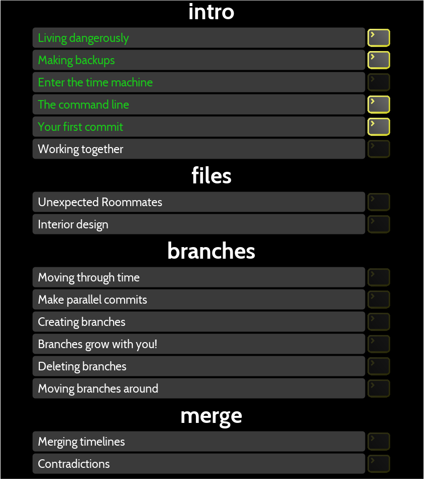
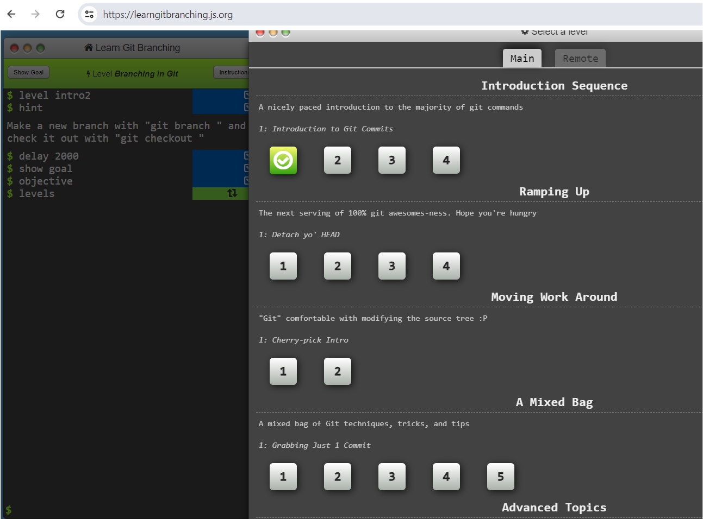
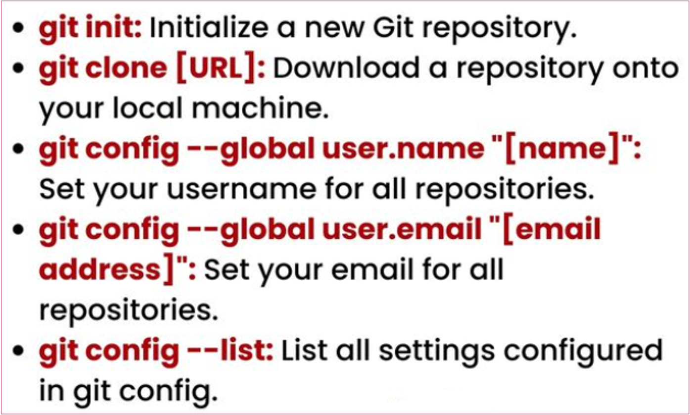
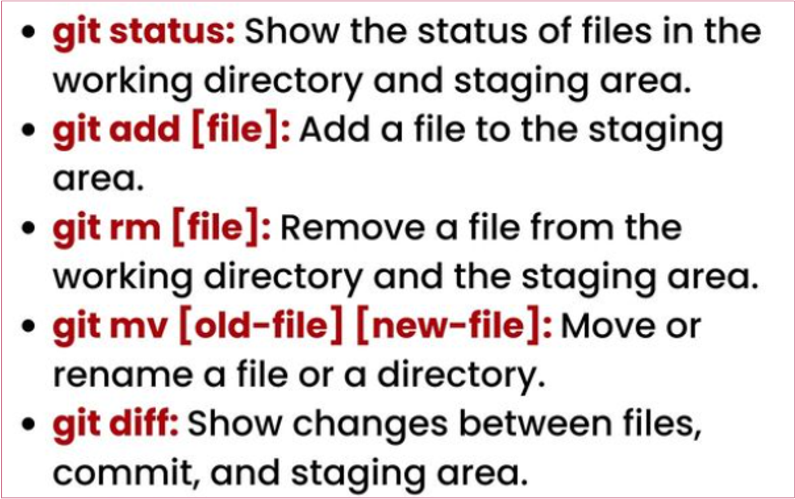
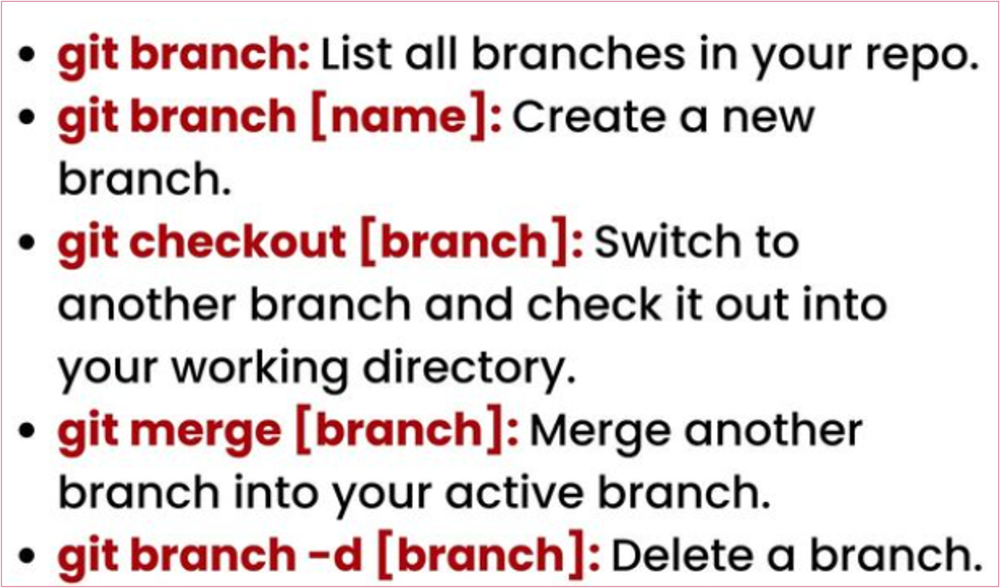
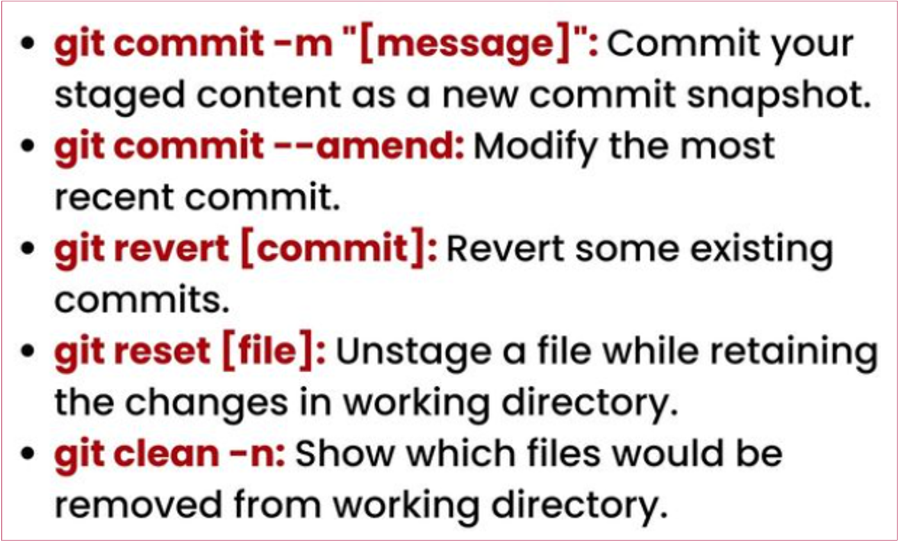
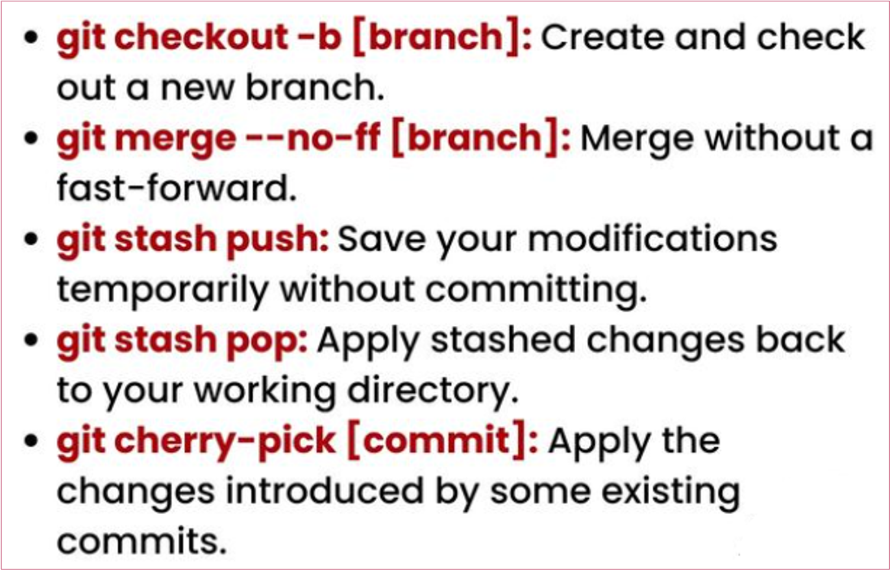
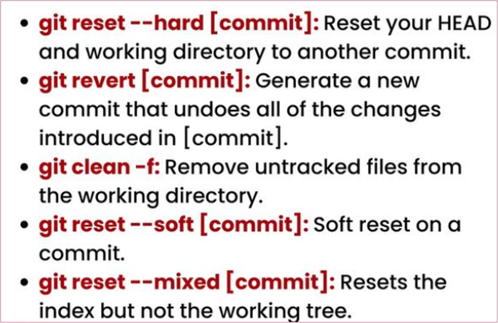
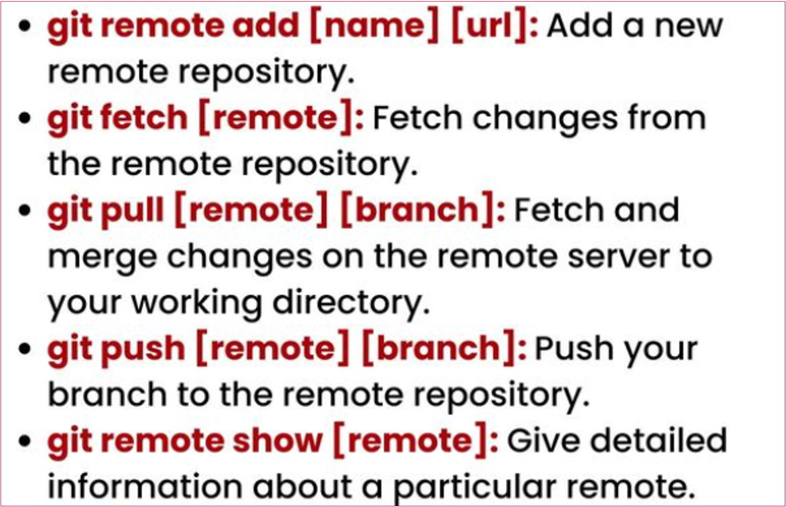

# Git: A Hands-on Intro Continued

## Creating a branch

<strong>Goals</strong>

- Learn how to create a local branch in the repository.

Developing a new feature is always risky: it may take a while, you might want to cancel it in the end, etc. For this reason, it
is best to isolate feature development in a separate branch. When the feature is ready, you can merge that branch into the
`main` branch. Until then, your `main` is kept safe from risky and untested code. Moreover, you can work on multiple features
in parallel, each in its own branch. You can also commit to `main` at any time, for example, to fix a bug.

### Create a branch

It is time to make our page more stylish with a touch of CSS. We'll develop this feature in a new branch called `style`:

```bash
git switch -c style
git status
```

> ℹ️ <strong>Note</strong> <br>
> Old timers may object because they were taught to create branches with the `git checkout -b style` command.
> Remember I mentioned that the `checkout` command is overloaded with features and flags? The old way still works,
> but it's discouraged. The new `git switch` command is more expressive and less error-prone. It also has fewer flags
> and options, so it's easier to remember.

### Add the `style.css` file

Create the file:

```bash
touch style.css
```

Add the following content to `style.css`:

```css
h1 {
  color: red;
}
```

Stage and commit your changes:

```bash
git add style.css
git commit -m "Added css stylesheet"
```

### Change `hello.html` to use `style.css`

Add a `<link>` tag to `hello.html` as follows:

```html
<html>
  <head>
    <link type="text/css" rel="stylesheet" media="all" href="style.css" />
  </head>
  <body>
    <h1>Hello, World!</h1>
  </body>
</html>
```

Stage and commit your changes:

```bash
git add hello.html
git commit -m "Included stylesheet into hello.html"
```

## Switching the branches

<strong>Goals</strong>

- Learn to switch between the repository branches.

Now our project has two branches:

```bash
git branch
```

### Switching to the `main` branch

To switch between branches, use the `git switch` command.

```bash
git switch main
cat hello.html
```

Now we are on the `main` branch. As you see, the `hello.html` has no traces of `style.css`. Don't worry; it is still in the repository, but we can't see it from the `main` branch.

### Let us return to the `style` branch

Run the following commands to return to the `style` branch:

```bash
git switch style
cat hello.html
```

## Moving Files

<strong>Goals</strong>

- Understand how to move files within the repository.

I'm pleased with the CSS modifications we've made, but there's one more thing I'd like to address before we merge our changes into the `main` branch. We should rename the `hello.html` file to `index.html` and moving our styles file into a
dedicated `css` directory.

### Examining the history of changes in a specific file

Git provides the capability to examine the change history of a specific file. Let's take a look at the change log for the `hello.html` file before we proceed with renaming it.

```bash
git log hello.html
git log style.css
```

### Comparing different versions of a specific file

Being able to view the change log of a specific file is incredibly useful. It allows you to track what modifications were
made, who made them, and when they were made. You can also see the changes associated with a specific commit. I
frequently use this feature to understand the workings of the current version of the code.

The `show` command is used to display the changes in a specific commit. Let's examine the changes in the `hello.html` file in the commit tagged with `v1` (you can use any commit reference, such as `HEAD`, branch or tag name, commit hash, etc.)

```bash
git show v1
```

### Renaming `hello.html`

As you can see, having the ability to view the change log of a specific file is extremely handy. However, when renaming or
moving a file, there's a risk of losing its history if not done correctly.

Let's proceed to rename our `hello.html` file to `index.html` using the standard `mv` command and observe the outcome:

```bash
mv hello.html index.html
git status
```

Git interprets our modification as if we've deleted the file and created a new one. This is a red flag. We need to inform Git
that we've renamed the file, not deleted and created a new one. In straightforward cases, Git will deduce that the file has
been renamed as soon as we add the file to the index:

```bash
git add .
git status
```

As you can see, Git lists the file as renamed. However, this is Git's attempt to be intelligent, and it doesn't always succeed.
For instance, if you've renamed and modified several files, Git might struggle to determine what exactly was renamed. In
such cases, you might lose the ability to view the file's history prior to its renaming, as Git would treat it as a newly added
file.

### Safely moving `style.css`

In most operating systems, renaming and moving files are essentially the same operation. So, let's move our `style.css` file to the `css` directory. This time, however, we'll use the `git mv` command to ensure the move is recorded in Git's history as
a move, not as a deletion and addition of a new file.

```bash
mkdir css
git mv style.css css/style.css
git status
```

Now, let's commit our changes and examine the change history of the `css/styles.css` file. To see the file's history prior to its relocation, we'll need to include the `--follow `option. Let's execute both versions of the command to understand the
difference.

```bash
git commit -m "Renamed hello.html; moved style.css"
git log css/style.css
git log --follow css/style.css
```

## Changes in the main/master branch

<strong>Goals</strong>

- Learn how to work with several branches with different (sometimes conflicting) changes.

As I mentioned previously, Git lets you work with several branches at the same time. It is very useful when working in a
team because people can work on different features in parallel. It is also useful when working solo: while developing
features in separate branches, you can still fix bugs and release minor updates using stable code in the `main` branch.

### Create the `README` file

We are currently in the `style` branch. The `README` file is not part of this branch, so we must switch to the `main` branch before creating and committing it:

```bash
git switch main
```

Now let's create a README file for our project:

```bash
touch README
```

Add the following content to the `README` file:

```
This is the Hello World example from the Git tutorial.
```

### Commit the `README` file to the `main` branch

Now we can stage and commit the file:

```bash
git add README
git commit -m "Added README"
```

## Viewing diverging branches

<strong>Goals</strong>

- Learn how to view diverging branches in a repository.

### View current branches

We now have two diverging branches in the repository. Use the following `log` command to view the branches and how they diverge.

```bash
git log --all --graph
```

The `--all` flag guarantees that we see all the branches. By default, only the current branch is displayed.

The `--graph` option adds a simple commit tree represented with basic text lines. We see both branches (`style` and `main`) and that the branch `main` is marked as `HEAD`, meaning that it's current. The common ancestor to both branches is the
branch where the "Added copyright statement with email" commit has been introduced.

## Merging

<strong>Goals</strong>

- Learn how to merge two distinct branches to restore changes to a single branch.

### Merge the branches

Merging brings changes from two branches into one. Let us go back to the `style` branch and merge it with `main`.

```bash
git switch style
git merge main
git log --all --graph
```

Through periodic `main` branch merging with the 1 branch you can pick up any changes or modifications to the `main`to maintain compatibility with the `style` changes in the mainline.

However, it does produce ugly commit graphs. Later we will look at the option of rebasing rather than merging.

## Merge conflict

<strong>Goals</strong>

- Create a conflicting change in the main branch.

When you merge two branches, Git tries to move the changes from one branch to the other. If the same part of the file was changed in both branches, Git may not be able to combine the changes automatically. In this case, Git will report a conflict and ask you to resolve it manually. In this lesson, we will simulate a conflict and later learn how to resolve it.

In real life merge conflicts happen regularly when working in the team. For example, you and your colleague started working on two different features, affecting the same files. Your colleague finished his work first and merged his changes to the `main` branch. Now you want to merge your own changes to the `main` branch as well. But the `main` branch is now different from the one you started working on—there is new code, submitted by your colleague. Most likely, Git will not be able to merge your changes automatically and will ask for human assistance.

### Switch back to the `main` and create conflict

Remember, in our `main` branch, the page is still called `hello.html`? Switch back to the `main` branch and make the following changes:

```bash
git switch main
```

```html
<!-- Author:           -->
<html>
  <head>
    <title>Hello World page</title>
  </head>
  <body>
    <h1>Hello, World!</h1>
    <p>Let's learn Git together.</p>
  </body>
</html>
```

Run the following commands:

```bash
git add hello.html
git commit -m "Added meta title"
```

### View branches

```bash
git log --all --graph
```

After the "Added README" commit, the `main` branch has been merged with the `style` branch, but there is an additional `main` commit, which was not merged back to the `style` branch.

The last change in `main` conflicts with some changes in the `style` branch. In the next step we will solve this conflict.

## Resolving conflicts

<strong>Goals</strong>

- Learn to resolve merging conflicts.

### Merge the `main` branch into the `style` branch

Let us return to the `style` branch and merge in all the recent changes from the `main`.

```bash
git switch style
git merge main
```

It seems that we have a conflict. No surprise here! Let us see what Git has to say about it:

```bash
git status
```

The section between `<<<<<<<` and `>>>>>>>` represents the conflict. The upper section corresponds to the `style` branch, which is the current branch (or `HEAD`) of the repository. The lower section represents changes from the `main` branch. Git is unable to determine which changes to apply, hence it requires manual conflict resolution. You are free to retain changes from either the `style` or `main` branch, combine them, or make any other modifications to the file.

Interestingly, our second change, the `<p>` tag, is not part of the conflict. Git has managed to merge it automatically.

If you open the `index.html` you will see:

```html
<!-- Author:           -->
<html>
  <head>
    <<<<<<< HEAD:index.html
    <link type="text/css" rel="stylesheet" media="all" href="style.css" />
    =======
    <title>Hello World Page</title>
    >>>>>>> main:hello.html
  </head>
  <body>
    <h1>Hello, World!</h1>
    <p>Let’'s learn Git together.</p>
  </body>
</html>
```

### Aborting merge

Jumping straight to the conflict resolution may not be a best strategy. The conflict may be caused by the changes you are
unaware of. Or the changes are too significant to address right away. For this reason, Git allows you to abort the merge
and return to the state before the merge. To do that, you can use the `git merge --abort` command, as suggested by `status` command we ran earlier.

```bash
git merge --abort
git status
```

### Resolving the conflict

After some meditation, we are ready to handle the conflict. Let us rerun the merge.

```bash
git merge main
```

To resolve the conflict, we need to edit the file to the state we're happy with and then commit it as usual. In our case, we will combine the changes from both branches. So, we edit the file to the following state:

```html
<!-- Author:           -->
<html>
  <head>
    <title>Hello World page</title>
    <link type="text/css" rel="stylesheet" media="all" href="style.css" />
  </head>
  <body>
    <h1>Hello, World!</h1>
    <p>Let's learn Git together.</p>
  </body>
</html>
```

### Commit the resolved conflict

Run the following commands to commit the resolved conflict:

```bash
git add index.html
git commit -m "Resolved merge conflict"
git status
git log --all --graph
```

### Advanced Merging

Git has no graphical merging tools, but it will accept any third-party merge tool.

## Rebase vs. Merge

<strong>Goals</strong>

- Learn the difference between rebasing and merging.
- Reset the branch style to the point before the first merge with main.
- To use rebase instead of the merge command.

### Discussion

Let us look at the differences between rebasing and merging. To do this, we need to get back into the repository at the time prior to the first merge, and then repeat the same steps but using relocating instead of merging.

We will use the `reset` command to return the branch to a previous state.

### Resetting the `style` branch

Let us go to the `style` branch to the point before we had merged it with the `main` branch. We can `reset` the branch to
any commit. In fact, the `reset` command can change the branch pointer to point to any commit in the tree.

Here, we want to go back in the `style` branch to a point before merging with the `main . We have to find the last commit
before the merge.

```bash
git switch style
git log --graph
```

It's a little hard to read, but we can see from the output that the "Renamed hello.html; moved style.css" commit was the
latest on the `style` branch prior to the first merging with `main`. Let us reset the `style` branch to this commit. To reference
that commit, we either use its hash, or deduct that this commit is 2 commits before the `HEAD`, or `HEAD~2` in Git notation.

```bash
git reset --hard HEAD~2
```

### Check the branch

Now, lets check the log of the `style` branch. There should be no merge commits in the log.

```bash
git log --graph
```

### Rebase the `style` branch onto `main`

We have reverted the `style` branch to the point in history before the first merge. There are two commits that are in the
`main` branch, but not in the `style` branch: the new `README` file and that conflicting change in the `index.html` file. This time,
we will move these changes to the `style` branch using the `rebase` command rather than `merge`.

```bash
git switch style
git rebase main
git status
```

There's a conflict again! Note that the conflict is in `hello.html`, not in `index.html` as the last time. It is because rebase
was in the process of applying the `style` changes on top of the `main` branch. The file `hello.html` hasn't been renamed in
`main` yet, so it still has its old name.

When merging, we would have a "reverse" conflict. During the merge, the changes of the `main` branch are applied on top
of the `style` branch. The `style` branch has the file renamed, so the conflict would be in `index.html`:

```html
<!-- Author:           -->
<html>
  <head>
    <<<<<<< HEAD
    <title>Hello World Page</title>
    =======
    <link type="text/css" rel="stylesheet" media="all" href="style.css" />
    >>>>>>> 983ebld (Included stylesheet into hello.html)
  </head>
  <body>
    <h1>Hello, World!</h1>
    <p>Let’'s learn Git together.</p>
  </body>
</html>
```

### Resolve the conflict

The conflict itself can be resolved in the same way we did before. First, we edit the `hello.html` file to meet our
expectations.

But after that, we don't need to commit the changes. We can just add the file to the index and continue the rebase
process. This is why I love rebase! It allows me to fix conflicts without creating a bunch of ugly merge conflicts.

> ℹ️ <strong>Note</strong> <br>
> For simplicity's sake, we can add all files using `.`, which stands for the path of the current directory. Git interprets this
> as "add all files in the current directory and its subdirectories”.

Run:

```bash
git add .
git rebase --continue
```

Here, most likely, Git will open the editor again, to let us change the commit message. We can leave the message as it is.
Upon saving changes, Git will finish the rebase process, and we can proceed with the following commands:

```bash
git status
git log --all --graph
```

### Merging VS rebasing

The result of the `rebase` command looks much like that of the `merge` command. The `style` branch currently contains all its
changes, plus all the changes of the `main` branch. The commit tree, however, is a bit different. The `style` branch commit
tree has been rewritten to make the `main` branch a part of the commit history. This makes the chain of commits linear and
more readable.

### When to use the `rebase` command, and when the `merge` command?

Use the `rebase` command:

- When you fetch changes from a remote repository and want to apply them to your local branch.
- If you want to keep the commit history linear and easy to read.

Don't use the `rebase` command:

- If the current branch is public and shared. Rewriting such branches will hinder the work of other team members.
- When the exact commit branch history is important (because the `rebase` command rewrites the history of commits).

Given the above recommendations, I prefer to use `rebase` for short-term, local branches and the `merge` command for branches in the public repository.

## Merging to the main/master branch

<strong>Goals</strong>

- We have kept our `style` branch up to date with the `main` branch (using `rebase`), but now let's merge the `style` branch changes back into main.

### Merge `style` into `main`

```bash
git switch main
git merge style
```

Since the last commit in `main` directly precedes the last commit of the `style` branch, Git can merge fast-forward by
simply moving the branch pointer forward, pointing to the same commit as the `style` branch.

Conflicts do not arise in the fast-forward merge. Also, fast-forward merges do not create a merge commit.

### Check the logs

```bash
git log --all --graph
```

Now the `style` and `main` branches are identical.

## Working with multiple repositories

So far, we have been working with only one Git repository. However, Git is a <strong>distributed</strong> version control system, meaning
it's great for working with several repositories. These additional repositories can be stored locally, accessed via a network
connection, or over the Internet. They can also be hosted on GitHub, GitLab, BitBucket, or any other Git hosting service.

In the next section, we will pretend that we decided to take some work home. In the day of yore, you could have carried
this repository on a flash drive and brought it home. Nowadays, we would likely share the repository via GitHub. The truth
is, it doesn't matter how you share your work: Git will work the same way. Most of the information in this section can also
be applied to working with multiple repositories, whether they are stored locally or shared over a network.

So, for the sake of simplicity, we will pretend that we are using two independent repositories, while having them locally in
separate directories, `work` and `home`.


## Cloning repositories

<strong>Goals</strong>

- Learn how to make copies of the repositories.

If you are working in a team, the following 8 lessons are quite important to understand because you almost always have to
work with cloned repositories.

### Go to your `repositories` directory

Run the following commands:

```bash
cd ..
pwd
ls
```

### Create a clone of the `work` repository

Let's create a clone of the repository.

```bash
git clone work home
ls
```

### View the history of the cloned repository

Run:

```bash
git log --all
```

## Origin

<strong>Goals</strong>

- Learn about the naming of the remote repositories.

Run:

```bash
git remote
```

We see that the cloned repository knows the default name of the remote repository. To get more information about origin:

```bash
git remote show origin
```

We can see that the `origin` of the remote repository is the original `work` repo. Remote repos are typically stored on a
separate machine or a centralized server. However, as we see, they can also point to a repository on the same machine.
There is nothing so special about the name `origin`, but there is a convention to use it for the primary centralized
repository (if any).

## Remote branches

<strong>Goals</strong>

- Learn about local and remote branches.

Let's take a look at the branches in our cloned repository:

```bash
git branch
```

As we can see only the `main` branch is listed in it. Where is the `style` branch? `git branch` only lists the local branches by
default.

```bash
git branch -a
```

Git lists all the branches from the original repo, but the remote repository branches are not treated as local ones. If we
need our own `style` branch, we need to create it on our own. In a minute you will see how it is done.

## Changing the original repo

<strong>Goals</strong>

- To make changes to the original repository, so we can try to pull the changes.

### Make a change in the original `work` repository

```bash
cd ../ /work
```

Make the following changes to the `README` file:

```
This is the Hello World example from the Git tutorial.
(changed in origin)
```

Now add and commit this change

```bash
git add README
git commit -m "Changed README in original repo”
```

Now the original repo has more recent changes that are not included in the cloned version. Next we will pull those changes
across to the cloned repo.

## Fetching changes

<strong>Goals</strong>

- Learn how to pull changes from a remote repository.

```bash
cd ../home
git fetch
git log --all
```

We are now in the `home` repository.

At the moment, the repository contains all the commits from the original repo; however, they aren't integrated into the local branches of the cloned repository.

You'll find the commit named "Changed README in original repo” in the history. Notice that the commit includes
`origin/main` and `origin/HEAD`.

Now let's take a look at the "Renamed hello.html; moved style.css" commit. You'll see that the local `main` branch points to
this very commit, not the new commit we've just fetched.

This brings us to the conclusion that the `git fetch` command will fetch new commits from the remote repo, but won't merge them into the local branches.

## Merging the pulled changes

<strong>Goals</strong>

- Learn to get the fetched changes into the current branch and working directory.

### Check the README

We can show that the cloned `README` file has not been changed.

```bash
cat README
```

### Merge the pulled changes into the local `main` branch

Run the following command:

```bash
git merge origin/main
```

### Check the `README` again

Now we should see the changes.

```bash
cat README
```

These are the changes. Although `git fetch` does not merge the changes, we can manually merge them from the remote
repo.

### The `pull` command

The `fetch` command gives you precise control over what is pulled and merged, but for convenience, there is also a
command `pull` which fetches and merges changes from the remote branch into your current branch with one call.

```bash
git pull
```

... is equivalent to the following two steps:

```bash
git fetch
git merge origin/main
```

## Adding a tracking branch

<strong>Goals</strong>

- Learn how to add a local branch that tracks a remote branch.

Branches that start with `remotes/origin` belong to the original repository. Note that you don't have a `style` branch
anymore, but Git knows that it was in the original repository.

### Add a local branch tracking the remote branch

```bash
git branch --track style origin/style
git branch -a
git log --max-count=2
```

Now we can see the `style` branch in the branch list and log.

## Bare repos

<strong>Goals</strong>

- Learn to create bare repos.
- To add a bare repo as a remote to our original repo.
- Learn how to push changes to the remote repository.
- Learn how to pull changes from the shared repository.

A bare repository is a repository that doesn't have a working directory. It only contains the `.git` directory, the directory in
which Git stores all its internal data. The main purpose of these repositories is to be a central repository that developers
can push to and pull from, so there's no need in having a working directory. Bare repositories are also used in Git hosting
services like GitHub and GitLab. In the next several lessons we will learn how to create a bare repository and how to push
to it.

### Creating a bare repository

```bash
cd ..
git clone --bare work work.git
ls work.git
```

The convention is that repositories ending in `.git` are bare repositories. We can see that there is no working directory in
the `work.git` repo. Essentially it is nothing but the `.git` directory of a regular repo.

### Adding a bare repository

Let's add the `work.git` repository to our original repository:

```bash
cd work
git remote add shared ../work.git
```

We are now in the `work` repository.

### Pushing changes to the remote repository

Since bare repositories are usually shared on some sort of network server, it is usually difficult to cd into the repo and pull
changes. So we need to push our changes into other repositories.

Let's start by creating a change to be pushed. Edit the `README` and commit it:

```
This is the Hello World example from the Git tutorial.
(changed in the origin and pushed to shared)
```

```bash
git switch main
git add README
git commit -m "Added shared comment to readme”
```

Now send changes to the shared repository.

```bash
git push shared main
```

<i>The shared repository </i>is the one receiving changes sent by us. Remember, we added it as a remote repository in the previous lesson?

### Pulling changes from the shared repository

Quickly switch to the `home` repository and pull the changes we just sent to the shared repository.

```bash
cd ../home
git remote add shared ../work.git
git branch --track shared main
git pull shared main
cat README
```

## Hosting repo

<strong>Goals</strong>

- Learn how to set up Git server for sharing repositories.

Want to make your own GitHub? There are many ways to share Git repositories over the network. Here is a quick and dirty
way.

### Launch the Git server

```bash
# (From the "repositories” directory)
git daemon --verbose --export-all --base-path=.
```

Now, go to your repositories directory in a separate terminal window and run the following commands:

```bash
# (From the “"repositories™ directory)
git clone git://localhost/work.git network work
cd network work
ls
```

You will find a copy of the `work` project.

### Pushing to the Git Daemon

If you want to allow push to the repository Git Daemon, add `--enable=receive-pack` tag to the `git daemon` command. Be
attentive, this server does not perform authentication, so anyone can push changes to your repository.

### Sharing repositories

At this point, sky is the limit. Go wild! Rent a server, buy a domain name, host your repositories on this server, and you'll
enjoy your private GitHub!

Seriously, though, you can host your own private GitLab. It's free and open source.

## Forking Repositories

**Goals**

- Learn what forking is and when to use it.
- Understand the difference between cloning and forking.
- Learn the fork-and-pull workflow.

### What is Forking?

Forking creates a personal copy of someone else's repository on your GitHub/GitLab account. Unlike cloning (which creates a local copy), forking creates a server-side copy that remains connected to the original repository.

### When to Fork

**Use forking when:**
- Contributing to open-source projects where you don't have write access
- Experimenting with changes without affecting the original project
- Creating your own version of a project to develop independently

**Don't fork when:**
- You have write access to the repository (use branches instead)
- Working on private team repositories (use branches instead)

### The Fork Workflow

1. Fork the repository on GitHub/GitLab
2. Clone your fork locally
3. Create a feature branch
4. Make changes and commit
5. Push to your fork
6. Create a Pull Request to the original repository

## Git Large File Storage (LFS)

<strong>Goals</strong>

- Learn when and how to use Git LFS for large files.
- Understand the difference between regular Git tracking and LFS.
- Learn best practices for managing large binary files in Git repositories.

### What is Git LFS?

Git Large File Storage (LFS) is an extension that replaces large files in your repository with tiny pointer files, while storing the actual file contents on a remote server. This keeps your repository lightweight and fast while still providing version control for large assets.

Without LFS, every clone of your repository downloads the entire history of every large file, which can make repositories slow and unwieldy. LFS solves this by only downloading the large files you actually need.

### Installing Git LFS

On macOS, you can install Git LFS using Homebrew:

```bash
# Install Git LFS
brew install git-lfs

# Initialize Git LFS for your user account (one-time setup)
git lfs install
```

For other operating systems:
- **Windows**: Download from https://git-lfs.github.com/
- **Linux**: Use your package manager (e.g., `apt-get install git-lfs`)

### Tracking Files with LFS

Once installed, you need to tell Git LFS which files to track. This is done using the `git lfs track` command:

```bash
# Track all PDF files
git lfs track "*.pdf"

# Track all video files
git lfs track "*.mp4"
git lfs track "*.mov"

# Track all files in a specific directory
git lfs track "datasets/**"

# Track specific large binary files
git lfs track "*.psd"
git lfs track "*.zip"
```

When you run `git lfs track`, it creates or updates a `.gitattributes` file in your repository. This file must be committed to Git:

```bash
git add .gitattributes
git commit -m "Configure Git LFS tracking"
```

### Working with LFS Files

Once LFS is configured, you work with tracked files just like any other Git files:

```bash
# Add a large file (it will automatically be handled by LFS)
git add large-dataset.csv
git commit -m "Add dataset"
git push
```

Git LFS intercepts the add/commit/push operations and handles large files transparently.

### Viewing LFS Status

To see which files are managed by LFS:

```bash
# List all files tracked by LFS in the current repository
git lfs ls-files

# Check LFS status
git lfs status

# See which patterns are being tracked
git lfs track
```

### Cloning Repositories with LFS

When cloning a repository that uses LFS:

```bash
# Clone normally - LFS files will be downloaded automatically
git clone <repository-url>

# If you want to clone without downloading LFS files immediately
GIT_LFS_SKIP_SMUDGE=1 git clone <repository-url>

# Later, you can fetch LFS files when needed
git lfs pull
```

### Migrating Existing Files to LFS

If you already have large files in your repository history, you can migrate them to LFS:

```bash
# Migrate all PDF files from the entire history
git lfs migrate import --include="*.pdf"

# Migrate specific files
git lfs migrate import --include="large-file.zip"
```

> ⚠️ <strong>Warning</strong> <br>
> Migration rewrites Git history. Make sure to coordinate with your team before running this command on a shared repository.

### When to Use Git LFS

**Use LFS for:**
- Binary files larger than 100MB
- Machine learning models and datasets
- Video, audio, and high-resolution image files
- Compiled binaries and executables
- Design files (PSD, AI, Sketch files)
- Archives (ZIP, TAR.GZ files)
- Any frequently updated binary files

**Don't use LFS for:**
- Text files (source code, markdown, configs)
- Small images and assets (< 1MB)
- Files that compress well and change frequently
- Files that need to be diffed

### Removing Files from LFS

If you no longer want to track a file pattern:

```bash
# Untrack a pattern
git lfs untrack "*.pdf"

# Don't forget to commit the updated .gitattributes
git add .gitattributes
git commit -m "Stop tracking PDFs with LFS"
```

### Best Practices

1. **Track early**: Set up LFS tracking before adding large files to your repository.
2. **Use patterns**: Track entire file types (e.g., `*.psd`) rather than individual files.
3. **Commit .gitattributes**: Always commit your `.gitattributes` file so others benefit from LFS.
4. **Document usage**: Add a note in your README about which files are tracked by LFS.
5. **Monitor storage**: Keep an eye on your LFS storage usage to avoid surprise charges.
6. **Avoid rewriting history**: Once files are in LFS, avoid force-pushing or rebasing when possible.

## Git Test

### Option 1

As a Test for the Topic Git, we expect you to go through the game <span style="color: green; font-weight: bold;">Oh-my-Git</span> successfully, i.e. all the different levels/sections should be marked as a green/passed.

URL: https://ohmygit.org/



### Option 2

Alternatively, you can play another game <span style="color: green; font-weight: bold;">LearnGitBranching</span>.

Here, as well please send me your printscreens
of finished games with green check marks ;)

URL: https://learngitbranching.js.org/



## Summary of Commands

### Setting Up and Configuring



### Managing Files and Staging



### Branching and Merging



### Committing Changes



### Advanced Branching and Merging



### Undoing changes and Cleaning-up



### Remote repositories and Pushing changes



## Self-study Materials

- https://www.youtube.com/watch?v=DVRQoVRzMIY
- https://github.com/skills/introduction-to-github
