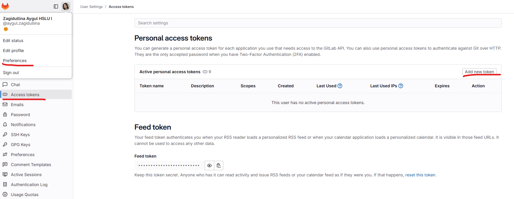
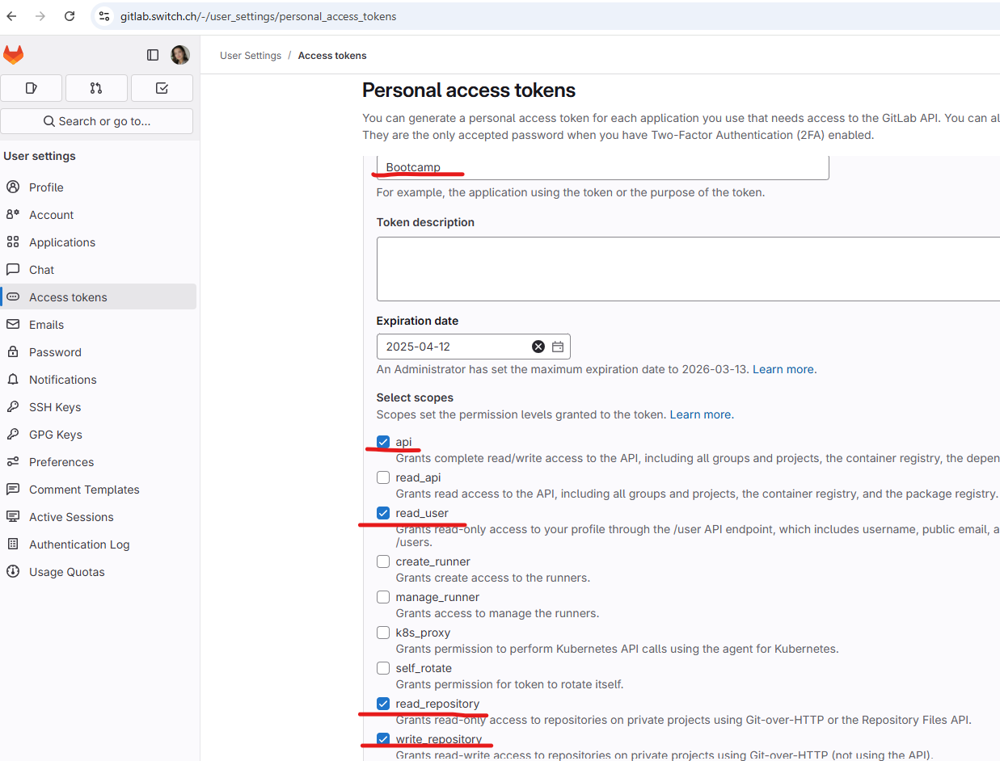

## GitHub account

Have you signed up to GitHub? If not, [do it right away](https://github.com/join).

:point_right: **[Upload a picture](https://github.com/settings/profile)** and put your name correctly on your GitHub account.

:point_right: **[Enable Two-Factor Authentication (2FA)](https://docs.github.com/en/authentication/securing-your-account-with-two-factor-authentication-2fa/configuring-two-factor-authentication#configuring-two-factor-authentication-using-text-messages)**. GitHub will send you text messages with a code when you try to log in. This is important for security and also will be required in order to contribute code on GitHub.

### GitHub CLI installation

Let's now install [GitHub official CLI](https://cli.github.com) (Command Line Interface). It's a software used to interact with your GitHub account via the command line.

In your terminal, copy-paste the following commands and type in your password if asked:

```bash
sudo apt remove -y gitsome # gh command can conflict with gitsome if already installed
curl -fsSL https://cli.github.com/packages/githubcli-archive-keyring.gpg | sudo dd of=/usr/share/keyrings/githubcli-archive-keyring.gpg
```

```bash
echo "deb [arch=$(dpkg --print-architecture) signed-by=/usr/share/keyrings/githubcli-archive-keyring.gpg] https://cli.github.com/packages stable main" | sudo tee /etc/apt/sources.list.d/github-cli.list > /dev/null
```

```bash
sudo apt update
```

```bash
sudo apt install -y gh
```

To check that `gh` has been successfully installed on your machine, you can run:

```bash
gh --version
```

:heavy_check_mark: If you see `gh version X.Y.Z (YYYY-MM-DD)`, you're good to go :+1:

:x: Otherwise, please **contact a teacher**


## GitHub CLI

CLI is the acronym of [Command-line Interface](https://en.wikipedia.org/wiki/Command-line_interface).

In this section, we will use [GitHub CLI](https://cli.github.com/) to interact with GitHub directly from the terminal.

It should already be installed on your computer from the previous commands.

First in order to **login**, copy-paste the following command in your terminal:

:warning: **DO NOT edit the `email`**

```bash
gh auth login -s 'user:email' -w
```

gh will ask you few questions:

`What is your preferred protocol for Git operations?` With the arrows, choose `SSH` and press `Enter`. SSH is a protocol to log in using SSH keys instead of the well known username/password pair.

`Generate a new SSH key to add to your GitHub account?` Press `Enter` to ask gh to generate the SSH keys for you.

If you already have SSH keys, you will see instead `Upload your SSH public key to your GitHub account?` With the arrows, select your public key file path and press `Enter`.

`Enter a passphrase for your new SSH key (Optional)`. Type something you want and that you'll remember. It's a password to protect your private key stored on your hard drive. Then press `Enter`.

`Title for your SSH key`. You can leave it at the proposed "GitHub CLI", press `Enter`.

You will then get the following output:

```bash
! First copy your one-time code: 0EF9-D015
- Press Enter to open github.com in your browser...
```

Select and copy the code (`0EF9-D015` in the example), then press `Enter`.

Your browser will open and ask you to authorize GitHub CLI to use your GitHub account. Accept and wait a bit.

Come back to the terminal, press `Enter` again, and that's it.

To check that you are properly connected, type:

```bash
gh auth status
```

:heavy_check_mark: If you get `Logged in to github.com as <YOUR USERNAME> `, then all good :+1:

:x: If not, **contact a teacher**.

## GitLab CLI

In addition to GitHub, we'll be using GitLab from the CLI to access the course material.

Let's start by installing the CLI tool:

```bash
sudo apt install glab
```

As GitLab is hosted on gitlab.switch.ch, we need to set this in the configuration:

```bash
glab config set -g host gitlab.switch.ch
```

Now it's time to generate a Personal Access Token (PAT) in order to login to your account. Open the [course repository](https://gitlab.switch.ch/hslu/edu/bachelor-computer-science/iai/hs25) and navigate to "Preferences" by clicking your profile in the top left corner.

Then click on "Access tokens" and add a new token.



You can name the token however you want, just be sure to not set an expiration date and to select the options circled in red:



Finally, click on "Create personal access token" and copy the token.

Come back to the terminal and run:

```bash
glab auth login
```

glab will ask you few questions:

`What GitLab instance do you want to log into?` With the arrows, choose the previously configured host `gitlab.switch.ch` and press `Enter`.

`How would you like to sign in?` Choose `Token` with the arrows and press `Enter`. Now paste your personal access token into the terminal.

`Choose default Git protocol:`: Choose the `HTTPS` protocol and press `Enter`.

`Authenticate Git with your GitLab credentials? (Y/n)` Type `Y` and press `Enter`.

You're all set! To check that you are properly connected, type:

```bash
glab auth status
```

:heavy_check_mark: If you get `Logged in to gitlab.switch.ch as <YOUR USERNAME>` , then all good :+1:

:x: If not, contact a teacher.

## Cloning the course repository

By cloning the course repository, you will have access to all the material locally on your computer. Run the following command in your terminal:

```bash
glab repo clone LINK_to_REPO
```