# Setup instructions

You will find below the instructions to set up your computer for the course.

Please **read them carefully and execute all commands in the following order**. If you get stuck, don't hesitate to ask a teacher for help :raising_hand:

## Windows version

Before we start, we need to check that the version of Windows installed on your computer is compatible with this setup instructions.

### Windows 10 or Windows 11

To be able to set up your computer, you need to have **Windows 10 or Windows 11** installed.

To check your Windows version:

- Press `Windows` + `R`
- Type `winver`
- Press `Enter`

:heavy_check_mark: If the first words of this window are **Windows 10 or Windows 11** you're good to go :+1:

:x: If not, you cannot proceed with this setup. You have to upgrade to Windows 10 first :point_down:

<details>
  <summary>Upgrade to Windows 10</summary>

- Download Windows 10 from [Microsoft](https://www.microsoft.com/software-download/windows10ISO)
- Install it. It should take roughly an hour, but this depends on your computer.
- When the installation is over, execute the commands above :point_up: to check that you now have **Windows 10**.
</details>

### Latest updates

Once you're sure that you're using Windows 10 or 11, you need to install all the latest updates.

Open Windows Update:

- Press `Windows` + `R`
- Type `ms-settings:windowsupdate`
- Press `Enter`
- Click on `Check updates`

:heavy_check_mark: If you see a green check mark and the message "You're up to date", you're good to go :+1:

:warning: If you have a red exclamation mark and the message "Update available", please install them and repeat the process until it says that you are up to date :loop:

:x: If you have an error message about Windows not being able to apply updates, please **contact a teacher**.

<details>
  <summary>Activate Windows Update Service to fix Updates</summary>

Some antiviruses and pieces of software deactivate the Update service we need, resulting in the error you see. Let's fix that!

- Press `Windows` + `R`
- Type `services.msc`
- Press `Enter`
- Double Click `Windows Update Service`
- Set its `Startup` to `Automatic`
- Click on `Start`
- Click on `Ok`
Then let's try updates again!
</details>

### Minimum version

Some of the tools we need to install have been released with the `1903` version **or above** of Windows 10 so we need to make sure you have at least this one.

- Press `Windows` + `R`
- Type `winver`
- Press `Enter`

Check the **Version number**:

:heavy_check_mark: If it says at least `1903`, you are good to go :+1:

:x: If it is below `1903`, please **contact a teacher**.

## Virtualization

We need to ensure that the Virtualization options are enabled in the BIOS of your computer.

For many computers, this is already the case. Let's check:

- Press `Windows` + `R`
- Type `taskmgr`
- Press `Enter`
- Click on the `Performance` tab
- Click on `CPU`

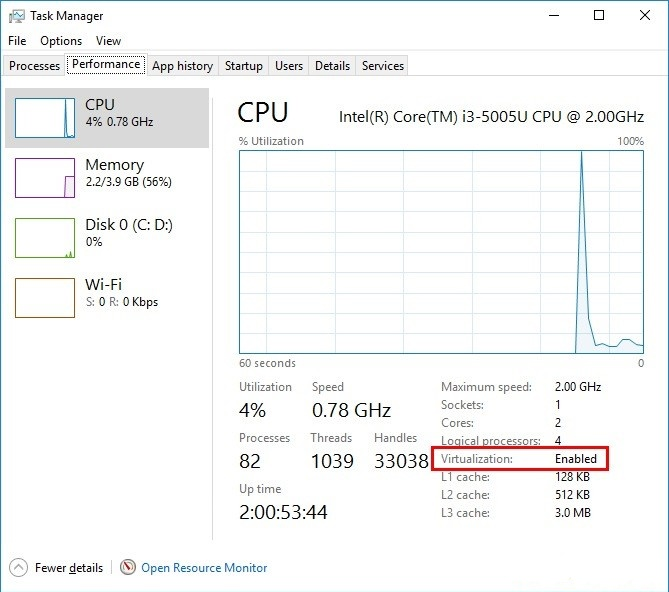

:heavy_check_mark: If you see "Virtualization: Enabled", you're good to go :+1:

:x: If the line is missing or if the virtualization is disabled, please **contact a teacher before trying to activate the Virtualization**

<details>
  <summary>Activate Virtualization</summary>

We need to access the BIOS / UEFI of the computer to activate it.

- Press `Windows + R`
- Type `shutdown.exe /r /o /t 1`
- Press `Enter`
- Wait for the computer to shutdown
- Click on `Troubleshoot`
- Click on `Advanced Options`
- Click on `UEFI Firmware Settings`
- Click on `Restart`

You need to activate the virtualization option for your processor here:

- Most of the time, in the advanced settings, the CPU settings, or the Northbridge settings
- The option can be called differently according to your computer:
  - Intel: `Intel VT-x`, `Intel Virtualization Technology`, `Virtualization Extensions`, `Vanderpool`...
  - AMD: `SVM Mode` or `AMD-V`
- Save the changes after activation and reboot the computer through the appropriate option
</details>

## Windows Subsystem for Linux (WSL)

WSL is the development environment we are using to run Ubuntu. You can learn more about WSL [here](https://docs.microsoft.com/en-us/windows/wsl/faq).

The following instructions depend on your version of Windows. Please execute only the instructions corresponding to your version :point_down:

### Windows 11

If you are running Windows 11, we will install WSL 2 and Ubuntu in one command through the Windows Terminal.

:warning: In the following instruction, please be aware of the `Ctrl` + `Shift` + `Enter` key stroke to execute **Windows Terminal** with administrator privileges instead of just clicking on `Ok`or pressing `Enter`.

- Press `Windows` + `R`
- Type `wt`
- Press **`Ctrl` + `Shift` + `Enter`**

:warning: You may have to accept the UAC confirmation about the privilege elevation.

A blue terminal window will appear:

- Copy the following command (`Ctrl` + `C`)
- Paste it into the terminal window (`Ctrl` + `V` or by right-clicking in the window)
- Run it by pressing `Enter`

```powershell
wsl --install
```

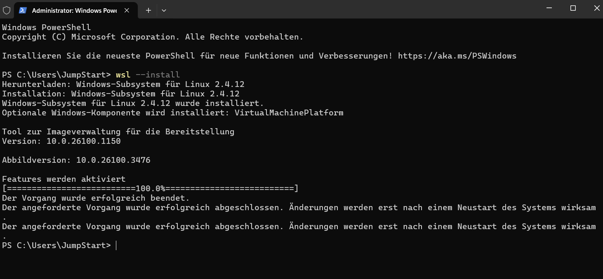

:heavy_check_mark: If the command ran without any error, please restart your computer and continue below :+1:

:x: If you encounter an error message (or if you see some text in red in the window), please **contact a teacher**

### Windows 10

#### Install WSL 1

If you are running Windows 10, we will first install WSL 1 through the PowerShell Terminal.

:warning: In the following instruction, please be aware of the `Ctrl` + `Shift` + `Enter` key stroke to execute **Windows PowerShell** with administrator privileges instead of just clicking on `Ok`or pressing `Enter`.

- Press `Windows` + `R`
- Type `powershell`
- Press **`Ctrl` + `Shift` + `Enter`**

:warning: You may have to accept the UAC confirmation about the privilege elevation.

A blue terminal window will appear:

- Copy the following commands one by one (`Ctrl` + `C`)
- Paste them into the PowerShell window (`Ctrl` + `V` or by right-clicking in the window)
- Run them by pressing `Enter`

```powershell
Enable-WindowsOptionalFeature -Online -FeatureName Microsoft-Windows-Subsystem-Linux
```

```powershell
dism.exe /online /enable-feature /featurename:Microsoft-Windows-Subsystem-Linux /all /norestart
```

```powershell
dism.exe /online /enable-feature /featurename:VirtualMachinePlatform /all /norestart
```

:heavy_check_mark: If all three commands ran without any error, please restart your computer and continue below :+1:

:x: If you encounter an error message (or if you see some text in red in the window), please **contact a teacher**

#### Upgrade to WSL 2

If you are running Windows 10, we will then upgrade WSL to version 2.

Once your computer has restarted, we need to download the WSL2 installer.

- Go to the [download page](https://aka.ms/wsl2kernel)
- Download "WSL2 Linux kernel update package"
- Open the file you've just downloaded
- Click `Next`
- Click `Finish`

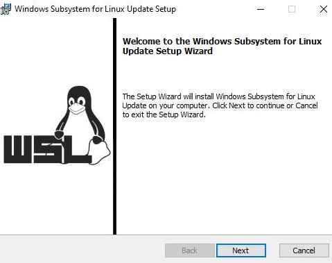

:heavy_check_mark: If didn't encounter any error message, you're good to go :+1:

:x: If you encounter the error "This update only applies to machines with the Windows Subsystem for Linux", **right click** on the program and select `uninstall`; you shall be able to install it normally this time.

#### Make WSL 2 the default Windows Subsystem for Linux

If you are running Windows 10, we will set WSL default version to 2.

Now that WSL 2 is installed, let's make it the default version:

- Press `Windows` + `R`
- Type `cmd`
- Press `Enter`

In the window which appears, type:

```bash
wsl --set-default-version 2
```

:heavy_check_mark: If you see "The operation completed successfully", you can close this terminal and continue to follow the instructions below :+1:

:x: If the message you get is about Virtualization, please **contact a teacher**

<details>
  <summary>Enable Virtual Machine Platform Windows feature</summary>

Follow the steps described [here](https://www.configserverfirewall.com/windows-10/please-enable-the-virtual-machine-platform-windows-feature-and-ensure-virtualization-is-enabled-in-the-bios/#:~:text=To%20enable%20WSL%202,%20Open,Windows%20feature%20on%20or%20off.&text=Ensure%20that%20the%20Virtual%20Machine,Windows%20will%20enable%20WSL%202) until you enable <strong>Virtual Machine Platform</strong> and <strong>Windows Subsystem for Linux</strong>

</details>

<details>
  <summary>Enable Hyper-V Windows feature</summary>

Follow the steps described [here](https://winaero.com/enable-use-hyper-v-windows-10/) until you enable the group <strong>Hyper-V</strong>

If you are running Windows 10 **Home edition**, Hyper-V feature is not available for your operating system. It's non-blocking and you can still continue to follow the instructions below :ok_hand:

</details>

## Ubuntu

### Installation

The following instructions depend on your version of Windows. Please execute only the instructions corresponding to your version :point_down:

#### Windows 11

If you are running Windows 11, after restarting you computer, you should see a terminal window saying WSL is resuming the Ubuntu installation process. When it's done, Ubuntu will be launched.

#### Windows 10

If you are running Windows 10, let's install Ubuntu throught the Microsoft Store:

- Click on `Start`
- Type `Microsoft Store`
- Click on `Microsoft Store` in the list
- Search for `Ubuntu` in the search bar
- **Select version without any number, just plain "Ubuntu"**
- Click on `Get`

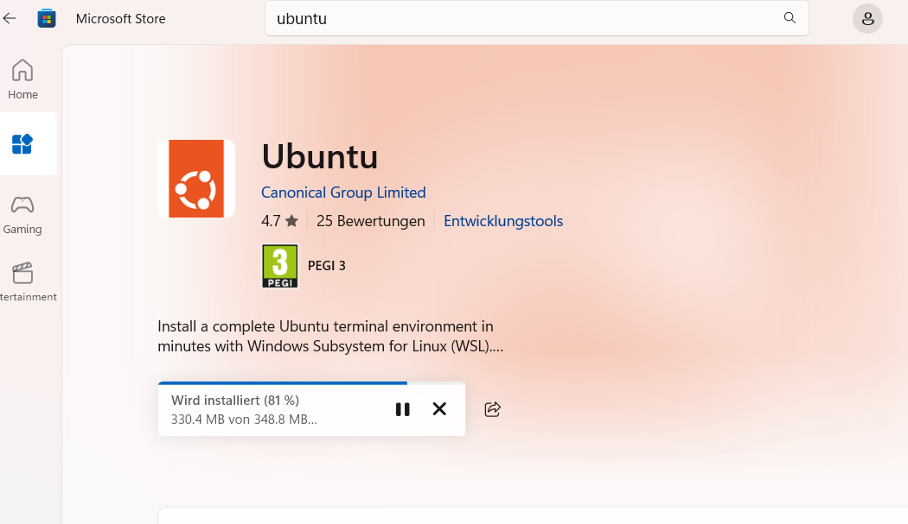

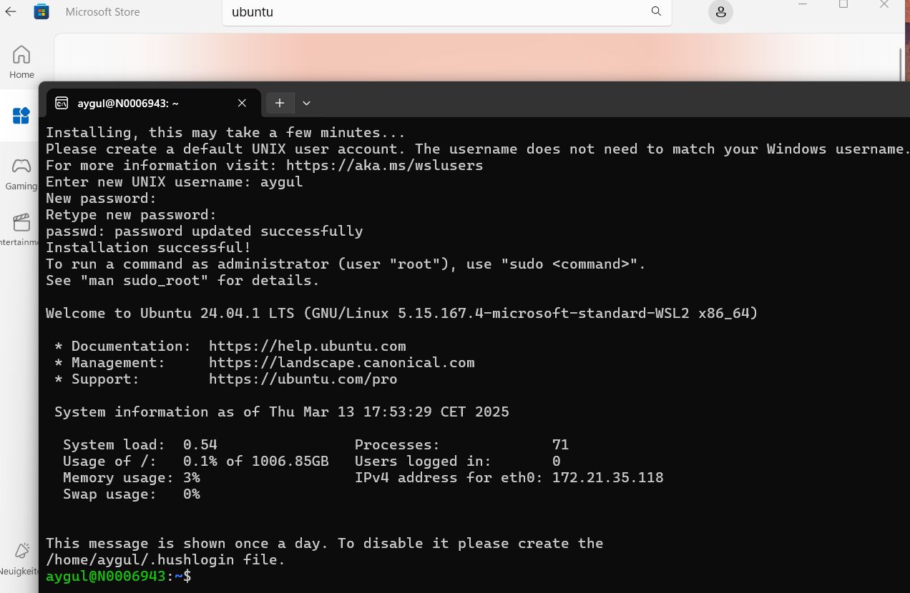

:warning: Don't install **Ubuntu 18.04 LTS** nor **Ubuntu 20.04**!

<details>
  <summary>Uninstall wrong versions of Ubuntu</summary>

To uninstall a wrong version of Ubuntu, you just have to go to the Installed Program List of Windows 10:

- Press `Windows` + `R`
- Type `ms-settings:appsfeatures`
- Press `Enter`

Find the software to uninstall and click on the uninstall button.

</details>

Once the installation is finished, the `Get` button becomes a `Open` button: click on it.

### First launch

At first launch, you will be asked some information:

- Choose a **username**:
  - one word
  - lowercase
  - no special characters
  - for example: `iai` or your `firstname`
- Choose a **password**
- Confirm your password

:warning: When you type your password, nothing will show up on the screen, **that's normal**. This is a security feature to mask not only your password as a whole but also its length. Just type your password and when you're done, press `Enter`.

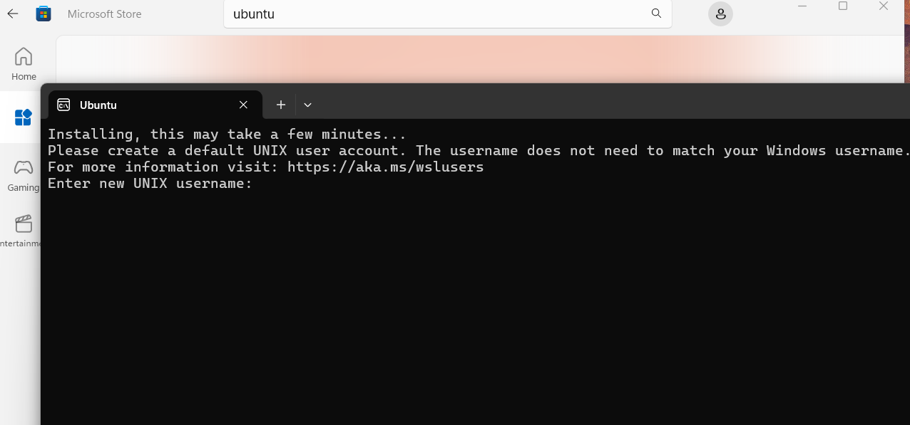

You can close the Ubuntu window now that it is installed on your computer.

### Check the WSL version of Ubuntu

- Press `Windows` + `R`
- Type `cmd`
- Press `Enter`

Type the following command:

```bash
wsl -l -v
```

:heavy_check_mark: If the version of Ubuntu WSL is 2, you are good to go :+1:

:x: If the version of Ubuntu WSL is 1, we will need to convert it to version 2.

<details>
  <summary>Convert Ubuntu WSL V1 to V2</summary>

In the Command Prompt window, type:

```bash
wsl --set-version Ubuntu 2
```

:heavy_check_mark: After a few seconds, you should get the following message: `The conversion is complete`.

:x: If it does not work, we need to be sure that Ubuntu files are not compressed.

</details>

<details>
  <summary>Check for Uncompressed Files</summary>

- Press `Windows` + `R`
- Type `%localappdata%\Packages`
- Press `Enter`
- Open the folder named `CanonicalGroupLimited.UbuntuonWindows...`
- Right Click on the `LocalState` folder
- Click on `Properties`
- Click on `Advanced`
- Make sure that the option `Compress content` is **not** ticked, then click on `Ok`.

Apply changes to this folder only and try to convert the Ubuntu WSL version again.

:x: If the conversion still does not work, please **contact a teacher**.

</details>

### Check the locale

The locale is a mechanism allowing to customize programs to your language and country.

Let's verify that the default locale is set to English, please type this in the Ubuntu terminal:

```bash
locale
```

If the output does not contain `LANG=en_US.UTF-8`, run the following command in a Ubuntu terminal to install the english locale:

```bash
sudo locale-gen en_US.UTF-8
```

If after, you receive a warning (`bash: warning: setlocale: LC_ALL: cannot change locale (en_US.utf-8)`) in your terminal, please do the following:

<details>
  <summary>Generate locale</summary>

Please, run this lines in your terminal.

```bash
sudo update-locale LANG=en_US.UTF8
sudo apt-get update
sudo apt-get install language-pack-en language-pack-en-base manpages
```

</details>

You can now close this terminal window.

## Visual Studio Code

### Installation

Let's install [Visual Studio Code](https://code.visualstudio.com) text editor.

- Go to [Visual Studio Code download page](https://code.visualstudio.com/download).
- Click on "Windows" button
- Open the file you have just downloaded.
- Install it with few options:

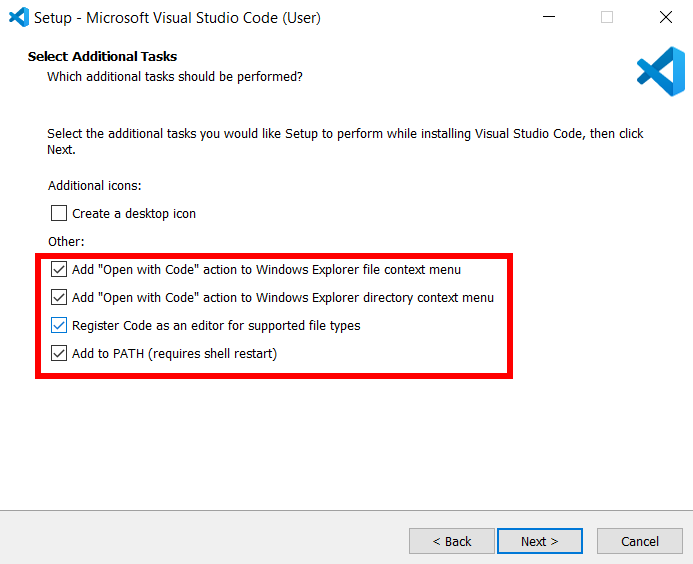

When the installation is finished, launch VS Code.

### Connecting VS Code to Ubuntu

To make VS Code interact properly with Ubuntu, let's install the [Remote - WSL](https://marketplace.visualstudio.com/items?itemName=ms-vscode-remote.remote-wsl) VS Code extension.

Open your **Ubuntu terminal**.

Copy-paste the following commands in the terminal:

```bash
code --install-extension ms-vscode-remote.remote-wsl
```

Then open VS Code from your terminal:

```bash
code .
```

:heavy_check_mark: If you see `WSL: Ubuntu` in the bottom left corner of the VS Code window, you're good to go :+1:

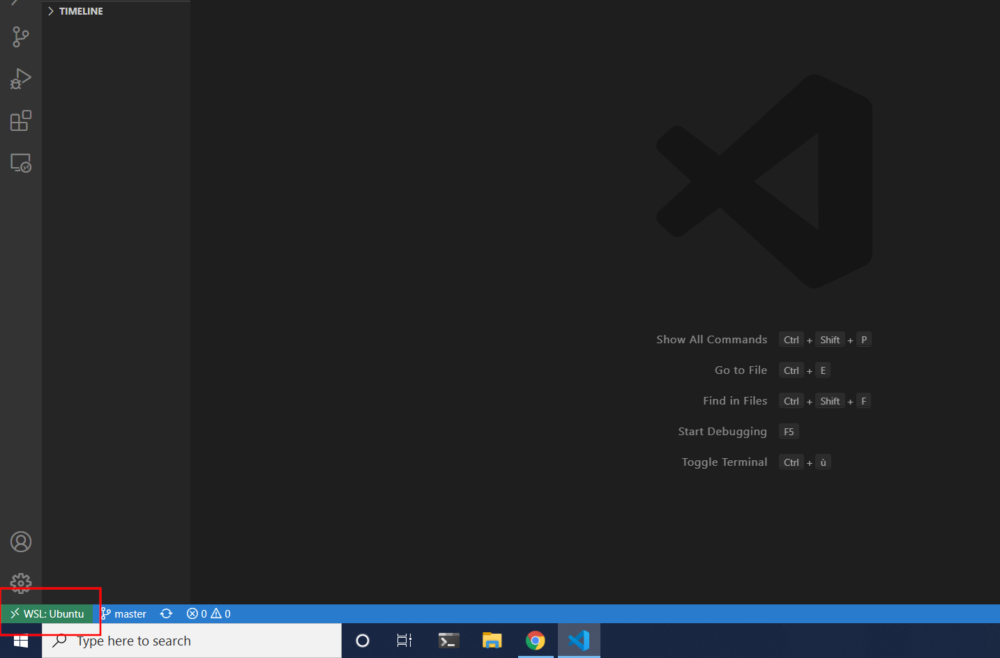

:x: Otherwise, please **contact a teacher**

## Windows Terminal

### Installation

The following instructions depend on your version of Windows.

If you are running Windows 11, the Windows Terminal is already installed and you can proceed to the next section :point_down:

If you are running Windows 10, let's install Windows Terminal, a real modern terminal:

- Click on `Start`
- Type `Microsoft Store`
- Click on `Microsoft Store` in the list
- Search for `Windows Terminal` in the search bar
- **Select Windows Terminal"**
- Click on `Install`

:warning: DO NOT install **Windows Terminal Preview**, just **Windows Terminal**!

<details>
  <summary>Uninstall wrong version of Windows Terminal</summary>

To uninstall a wrong version of Windows Terminal, you just have to go to the Installed Program List of Windows 10:

- Press `Windows` + `R`
- Type `ms-settings:appsfeatures`
- Press `Enter`

Find the software to uninstall and click on the uninstall button.

</details>

Once the installation is finished, the `Install` button becomes a `Launch` button: click on it.

### Ubuntu as the default terminal

Let's make Ubuntu the default terminal of your Windows Terminal application.

Press `Ctrl` + `,`

It should open the terminal settings:

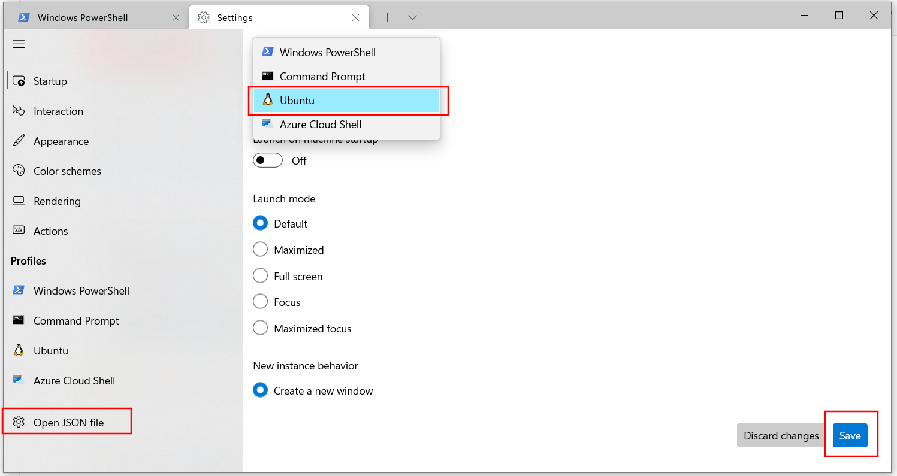

- Change the default profile to "Ubuntu"
- Click on "Save"
- Click on "Open JSON file"

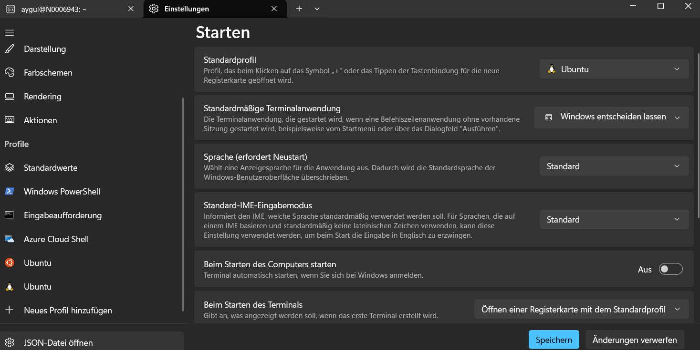

You may see an orange circle rather than a penguin as the logo for Ubuntu.

We have circled in red the part you will need to change:


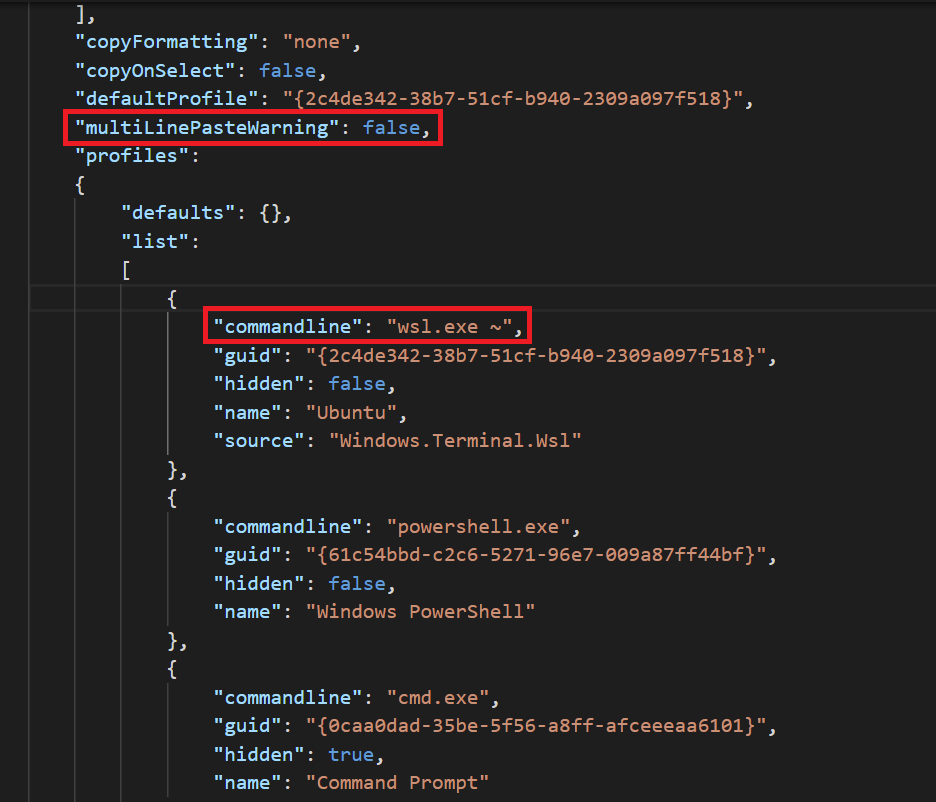

First, let's ask Ubuntu to start directly inside your Ubuntu Home Directory instead of the Windows one:

- Locate the entry with both `"name": "Ubuntu",` and `"hidden": false,`
- Add the following line after it:

```bash
"commandline": "wsl.exe ~",
```

:warning: Do not forget the comma at the end of the line!

Then, let's disable warning for copy-pasting commands between Windows and Ubuntu:

- Locate the line `"defaultProfile": "{2c4de342-...}"`
- Add the following line after it:

```bash
"multiLinePasteWarning": false,
```

:warning: Do not forget the comma at the end of the line!

You can save these changes by pressing `Ctrl` + `S`

:heavy_check_mark: Your **Windows Terminal** is now setup :+1:

This terminal has tabs: you can choose to open a new terminal tab by clicking on the **+** next to the current one.

**From now on, every time we will refer to the terminal or the console it will be this one.** DO NOT use any other terminal anymore.

## VS Code Extensions

### Installation

Let's install some useful extensions to VS Code.

```bash
code --install-extension ms-vscode.sublime-keybindings
code --install-extension emmanuelbeziat.vscode-great-icons
code --install-extension MS-vsliveshare.vsliveshare
code --install-extension ms-python.python
code --install-extension KevinRose.vsc-python-indent
code --install-extension ms-python.vscode-pylance
code --install-extension ms-toolsai.jupyter
```

Here is a list of the extensions you are installing:

- [Sublime Text Keymap and Settings Importer](https://marketplace.visualstudio.com/items?itemName=ms-vscode.sublime-keybindings)
- [VSCode Great Icons](https://marketplace.visualstudio.com/items?itemName=emmanuelbeziat.vscode-great-icons)
- [Live Share](https://marketplace.visualstudio.com/items?itemName=MS-vsliveshare.vsliveshare)
- [Python](https://marketplace.visualstudio.com/items?itemName=ms-python.python)
- [Python Indent](https://marketplace.visualstudio.com/items?itemName=KevinRose.vsc-python-indent)
- [Pylance](https://marketplace.visualstudio.com/items?itemName=ms-python.vscode-pylance)
- [Jupyter](https://marketplace.visualstudio.com/items?itemName=ms-toolsai.jupyter)

### Live Share configuration

[Visual Studio Live Share](https://visualstudio.microsoft.com/services/live-share/) is a VS Code extension which allows you to share the code in your text editor for debugging and pair-programming: let's set it up!

Launch VS Code from your terminal by typing `code` and pressing `Enter`.

Click on the little arrow at the bottom of the left bar :point_down:

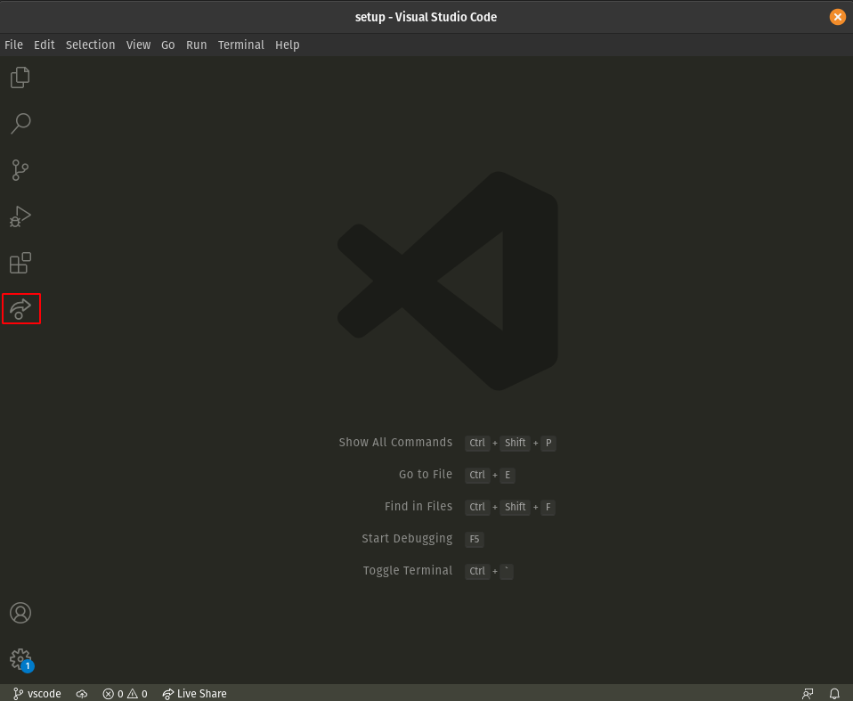

- Click on the "Share" button, then on "GitHub (Sign in using GitHub account)".
- A popup appears asking you to sign in with GitHub: click on "Allow".
- You are redirected to a GitHub page in you browser asking you to authorize Visual Studio Code: click on "Continue" then "Authorize github".
- VS Code may display additional pop-ups: close them by clicking "OK".

That's it, you're good to go!

## Windows settings

### Exchange files between Windows and Ubuntu

We need an easy way to transfer files from Windows to Ubuntu and vice versa.

In order to do that, let's create shortcuts to Ubuntu directories in the Windows **File Explorer**:

- Open the Windows File Explorer (or use the shortcut `WIN` + `E`)
- In the Address Bar, enter `\\wsl$\` (or `\\wsl$\Ubuntu` if it does not work)
- You now have acces to the Ubuntu file system
- Dive into the Ubuntu file system in order to look for directories of interest
- Drag the desired folders into the Address Bar in order to create shortcuts

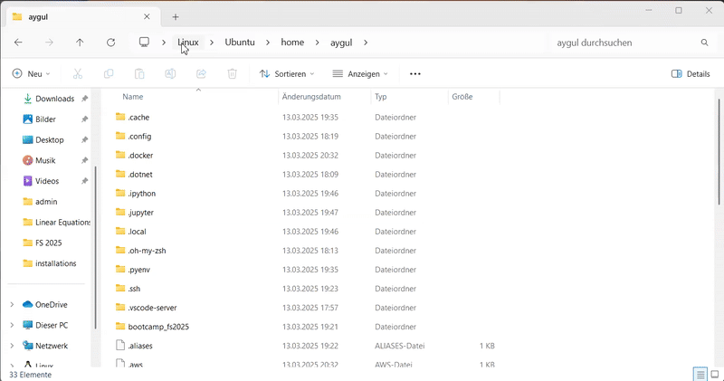

### Open the Windows File Explorer from the Ubuntu terminal

Another option to move files around is to open the Windows **File Explorer** from the Ubuntu terminal:

- Open an Ubuntu terminal
- Go to the directory you wish to explore
- Run the `explorer.exe .` command (alternatively, use `wslview .`)
- If you get an input output error message, run `wsl --shutdown` in a Windows PowerShell and reopen an Ubuntu terminal

### Find your way in the Ubuntu File System

You might want to figure out the exact location of a Windows directory in the Ubuntu file system, or the other way around.

In order to convert a Windows path to and from an Ubuntu path:

- Open an Ubuntu terminal
- Use the `wslpath "C:\Program Files"` command in order to translate a Windows path into an Ubuntu path
- Use the `wslpath -w "/home"` command in order to translate an Ubuntu path into a Windows path
- In particular, the `wslpath -w $(pwd)` command returns the Windows path of the current Ubuntu directory

### Pin apps to your taskbar

You are going to use most of the apps you've installed today really often. Let's pin them to your taskbar so that they are just one click away!

To pin an app to your taskbar, launch the app, right-click on the icon in the taskbar to bring up the context menu and choose "Pin to taskbar".

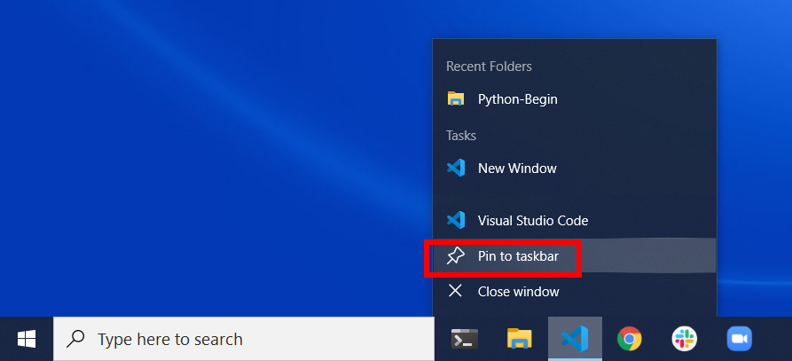

You must pin:

- Your terminal
- Your file explorer
- VS Code
- Your Internet browser


