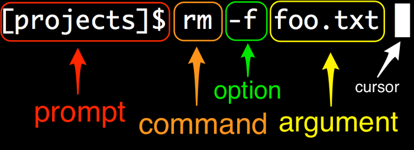
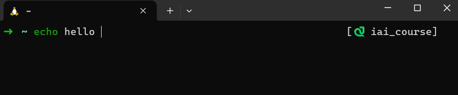
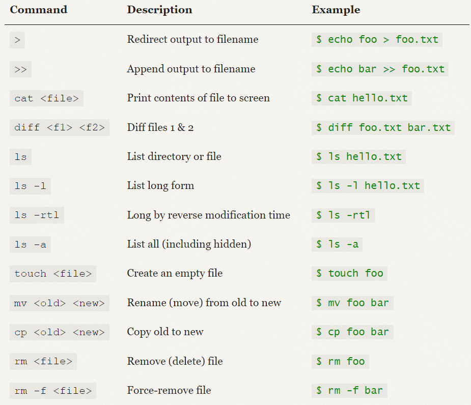

# Shell: Introduction and Advanced Topics

## 📌 What is the Shell?

**“In the Beginning… Was the Command Line.”**

Computers today offer various interfaces for interaction, including graphical user interfaces (GUIs), voice commands, and even augmented or virtual reality. While these interfaces cover most use cases, they are inherently limited — you can’t press a button that isn’t there or give a voice command that hasn’t been programmed. To fully utilize a computer’s capabilities, we need a more flexible approach: the Shell.

A Shell is a textual interface that allows users to interact with their computer by running commands. It allows users to:

✅ Run programs and execute commands

✅ Automate tasks and complex workflows not available through GUIs (e.g. combine multiple commands)

✅ Directly communicate with the operating system through commands

and provides more control through scripting compared to graphical interfaces.

The **Shell** is available across nearly all computing platforms, particularly on **Unix-based** systems such as **Linux, macOS, iOS, and Android**. These systems power most of the web, mobile devices, and cloud services. Even Windows has integrated Unix-like functionality through the **Windows Subsystem for Linux (WSL)**, making knowledge of the Unix command line relevant for all users.

While shells differ in syntax and features, they share a common purpose: enabling users to run programs, provide input, and analyze output in a structured way.

## 📌 Why Shell?

Many programming tutorials either overlook the command line or assume prior knowledge. However, mastering the command line is **essential** for becoming a skilled developer. Even experienced programmers heavily rely on terminal windows to run commands, automate workflows, and interact with their systems efficiently.

Proficiency in the shell is valuable not just for developers but also for anyone collaborating with them, including **product managers, project managers, and designers**. Understanding shell commands improves communication and enables non-technical roles to interact with development environments effectively.

📌 **Examples** of why learning the shell is beneficial:

- Developers use it to manage files, execute programs, and automate tasks.

- System administrators rely on it to control servers and configure systems.

- Data scientists leverage it to process large datasets efficiently.

- Cloud engineers interact with remote servers through SSH.

- Anyone working in tech benefits from understanding how to navigate and manipulate files quickly.

## 🐧 The Bourne Again SHell (Bash)

Bash is one of the most widely used shells and is available on most Unix-based systems (Linux/macOS). Its syntax is similar to many other shells, making it a great starting point.

## 🦓 Z Shell (Zsh)

[Zsh](https://www.zsh.org/) is a powerful command-line shell designed for both interactive use and scripting. It includes features such as:

✅  Advanced tab completion

✅ Command correction and approximate completion

✅ Shared command history across terminals

✅ Extended globbing for pattern matching

✅ Customizable prompts and themes (e.g., [Oh My Zsh](https://github.com/ohmyzsh/ohmyzsh/wiki))

✅ Path expansion (e.g., cd /u/lo/b expands to /usr/local/bin)

Moreover, Zsh can be enhanced with framework like [oh-my-zsh](https://github.com/ohmyzsh/ohmyzsh), which add further customization and usability improvements. Additional plugins like [zsh-syntax-highlighting](https://github.com/zsh-users/zsh-syntax-highlighting) and [zsh-history-substring-search](https://github.com/zsh-users/zsh-history-substring-search) offer more interactive features.

However, using too many extensions or poorly optimized scripts in your Zsh configuration can slow down your shell. Profiling and selectively enabling only the necessary features can help maintain efficiency.

## 🔧 Accessing the Shell

To use a shell, we need a terminal — a program that lets you enter shell commands. Most devices come with a terminal pre-installed.

Open one of the following terminal applications on your device:

📌 macOS: Open *Spotlight Search* (⌘ + Space) and type **Terminal**, then select the Terminal application. Advanced users may prefer **iTerm2** for additional customization.

📌 Windows: The best option is **Windows Terminal with WSL** (Windows Subsystem for Linux).

📌 Linux: Most distributions include a terminal by default. Open it from the applications menu or use shortcuts (Ctrl + Alt + T).

## 🔎 What is Prompt?

The prompt is the text displayed in the terminal that indicates it is ready to receive a command. It serves as a cue for the user to enter instructions. A typical command-line prompt consists of several components:



This is the customized prompt view in `Zsh`:




## 📂 Navigating in the Shell

A path specifies the location of a file or directory in the filesystem. Paths are categorized into two types:

- **Absolute Path**: Specifies a location from the root directory `(/)`. It starts with a `/` . For example, `/home/user/documents`.​

- **Relative Path**: Specifies a location relative to the current working directory. It does not start with a `/`. For example, if you're in `/home/user`, a relative path to documents would be `documents/`.​

In paths:

- `.` refers to the **current** directory.​
Linux Command

- `..` refers to the **parent** directory.

Here are some basic commands for navigating the file system:

```bash
pwd      # Print working directory (shows where you are)
cd ..    # Move up one directory
cd /     # Go to the root directory
cd ~     # Go to home directory
cd -     # Go to home directory as well
cd /path/to/directory  # Navigate to a specific directory
```


## 🏁 First Command

Before diving into more complex commands, let’s start with a simple one. The `echo` command is used to print text to the screen. This printed text appears in what is called standard output (stdout) — usually the terminal window.

To run the `echo` command, type:
```bash
echo hello
# hello <-- output of the command
```

The output "hello" appears immediately after pressing Enter. The prompt returns, indicating that the terminal is ready for the next command.

You can also use quotation marks to group words together:
```bash
echo "goodbye"
# goodbye
echo 'goodbye'
# goodbye
```

Both double and single quotes can be used to group text. However, in certain contexts, single and double quotes behave differently, which we will explore later.

Try also the `date` command.

## 🚨 Handling Errors in Commands

One common mistake is forgetting to close quotation marks:
```bash
echo "hello, goodbye
>
```
Here, the terminal is waiting for you to complete the command. If this happens, you can exit the unfinished command using `Ctrl-C`. This shortcut interrupts the process and returns you to a fresh prompt:
```bash
tail
^C
```

If `Ctrl-C` does not work, try pressing `Esc` to exit the command.

#### 📝 Exercises
- Write a command that prints out the string “hello, world”. Extra credit: do it two different ways, both with and without using quotation marks.
- Type the command echo 'hello (with a mismatched single quote), and then get out of trouble using the technique above.


## 📖 Manual Pages

The shell includes a built-in tool to access manual pages, commonly referred to as `man` pages. These pages provide documentation for commands and utilities available in the system.

To view the manual page for a command, use the man command followed by the command name:
```bash
man echo
```

This will display a detailed description of the echo command, including its syntax and available options.

```bash
Example output:

ECHO(1)          BSD General Commands Manual         ECHO(1)

NAME
   echo -- write arguments to the standard output

SYNOPSIS
   echo [-n] [string ...]

DESCRIPTION
   The echo utility writes any specified operands, separated by single blank
   (` ') characters and followed by a newline (`\n') character, to the standard output.

   The following option is available:

   -n  Do not print the trailing newline character.
```

### Navigating Man Pages

- Use the `down arrow key` to scroll line by line.

- Press the `spacebar` to move down one page at a time.

- Press `q` to exit the manual page.

Since `man` itself is a command, you can even check its own manual page:
```bash
$ man man
```
This command will display information about how to use the `man` command itself.

## 🧹 Clearing and Exiting the Terminal

When using the command line, it's often useful to clear the screen to remove clutter and keep your terminal organized. You can do this using the `clear` command:
```bash
clear
```
A convenient shortcut for this action is pressing `Ctrl + L`.

## 🔚 Exiting the Terminal

When you are done using a terminal session, you can exit the terminal window or tab using the `exit` command:
```bash
exit
```
Alternatively, you can use the shortcut `Ctrl + D` to close the terminal session quickly.

#### 📝 Exercises
- Write a command to print the string `Use "man echo"`, including the quotes; i.e., take care not to print out `Use man echo instead`. Hint: Use double quotes in the inner string, and wrap the whole thing in single quotes.
- By running `man sleep`, figure out how to make the terminal “sleep” for 5 seconds, and execute the command to do so.
- Execute the command to sleep for 5000 seconds, realize that’s well over an hour, and then use the instructions from above to get out of trouble.

## 🛠 Manipulating Files

One of the most fundamental tasks at the command line is manipulating files—creating, modifying, and comparing them. Instead of using a graphical text editor, the shell provides ways to create and edit files directly from the command line.

### 📄 Creating Files with Redirects

You can create a new file by redirecting output using the `>` operator:
```bash
echo "From fairest creatures we desire increase," > sonnet_1.txt
```
This command takes the output of echo and redirects it into a file called `sonnet_1.txt`. If the file does not exist, it will be created. If it does exist, its contents will be overwritten.

To view the contents of the file, use the `cat` command:
```bash
cat sonnet_1.txt
# From fairest creatures we desire increase,
```

🔄 Input and Output Streams

In the shell, programs operate with input and output streams:

- Input stream (**stdin**): Where a program reads input, usually from the keyboard.

- Output stream (**stdout**): Where a program writes output, usually to the screen.

These streams can be redirected to or from files:
```bash
echo "hello" > hello.txt  # Redirects output to a file
cat hello.txt
# hello

cat < hello.txt  # Reads input from a file instead of the keyboard
# hello

cat < hello.txt > hello2.txt  # Reads from hello.txt and writes to hello2.txt
cat hello2.txt
# hello
```

<br>
The cat command is used to concatenate and display file contents:
```bash
cat hello.txt hello2.txt > merged.txt  # Combines hello.txt and hello2.txt into merged.txt
```

### 📌 Appending to Files

To append new content to an existing file (instead of overwriting it), use the `>>` operator:
```bash
echo "That thereby beauty's Rose might never die," >> sonnet_1.txt
```
Now, viewing the file with `cat` will show both lines:
```bash
cat sonnet_1.txt
# From fairest creatures we desire increase,
# That thereby beauty's Rose might never die,
```
### 🔍 Comparing Files with diff

You can compare two files using the `diff` command. If two files have differences, `diff` will show what has changed:
```bash
diff sonnet_1.txt sonnet_1_lower_case.txt
# < That thereby beauty's Rose might never die,
# ---
# > That thereby beauty's rose might never die,
```

If there are no differences, diff will output nothing.

#### 📝 Exercises

- Create two files using `echo` and `>`: `line_1.txt` and `line_2.txt`, each containing one line of text.

- Recreate `sonnet_1.txt` by redirecting `line_1.txt` and appending `line_2.txt` to a new file called `sonnet_1_copy.txt`. Use `diff` to confirm they are identical.

- Combine the contents of two files in reverse order into `sonnet_1_reversed.txt` using a single `cat` command. Hint: The `cat` command can take multiple arguments.

## 📄 Listing Files and Directories

One of the most commonly used commands in the shell is `ls`, which stands for "list." It is used to display the files and directories within the current directory.
```bash
ls
# sonnet_1.txt   sonnet_1_reversed.txt
```

The `ls` command helps you check the contents of a directory. If you try listing a file that does not exist, you will see an error message:
```bash
ls foo
# ls: foo: No such file or directory
```
To create an empty file, you can use the `touch` command:
```bash
touch foo
ls foo
# foo
```

### ⭐ Using Wildcards

The wildcard character `*` can be used to list files matching a specific pattern. For example, to list all files ending in `.txt`, use:
```bash
ls *.txt
# sonnet_1.txt   sonnet_1_reversed.txt
```

### 📋 Listing Files with Details

To display more details about each file, including size and modification date, use the `-l` option:
```bash
ls -l *.txt
# total 16
# -rw-r--r-- 1 user staff  87 Jul 20 18:05 sonnet_1.txt
# -rw-r--r-- 1 user staff 294 Jul 21 12:09 sonnet_1_reversed.txt
```

#### 📜 File Permission Breakdown

The first character in `-rw-r--r--` indicates the type:

`-` → Regular file

`d` → Directory

`l` → Symbolic link

The next **nine characters** are divided into **three groups**:

*Owner (user)* – `rw-` (Read & Write access)

*Group* – `r--` (Read-only access)

*Others* – `r--` (Read-only access)

<br>

In *Unix-like systems*, each file and directory has a set of permissions that dictate who can read, write, or execute them. These permissions are categorized into three classes:

1) *Owner (user)*: The individual who owns the file or directory.​
2) *Group*: A set of users who share certain permissions (e.g. team members).​
3) *Others*: All other users who are neither the owner nor part of the group.

<br>

Each **permission set** has three possible values:

- `r` → Read: Allows viewing the contents of a file. For directories, it allows listing the directory’s contents.

- `w` → Write: Allows modifying the file. For directories, it allows adding or removing files within the directory.

- `x` → Execute: Allows running the file as a program. For directories, it allows accessing the directory (e.g., using `cd`).

#### 📌 Examples of File Permissions

```bash
# Read-only file (no writing allowed)
-r--r--r--  1 user staff  2048 Jan 1 12:34 readonly.txt

# Executable script (can be run as a program)
-rwxr-xr-x  1 user staff  4096 Jan 1 12:34 script.sh

# Directory with full permissions for owner
 drwx------  1 user staff  1024 Jan 1 12:34 private_folder
```

#### ✏️ Changing File Permissions

You can modify file permissions using the `chmod` command:

```bash
# Give execute permission to the owner
chmod u+x example.txt

# Remove write permission from the group
chmod g-w example.txt

# Set specific permissions (Owner: Read & Write, Group: Read, Others: No Access)
chmod 640 example.txt
```

Additional examples with `chmod`:
```bash
# Make a script executable
chmod +x script.sh
# Set read/write/execute permissions for user, and read/execute for others
chmod 755 file.txt
```

#### 👥 Changing File Ownership

To change file ownership, use the `chown` command:

```bash
# Change owner to 'newuser'
sudo chown newuser example.txt

# Change both owner and group
sudo chown newuser:staff example.txt
```
Understanding these commands helps control access and security for files on your system.


#### 🔗 Understanding the Number of Links

The number of links in the second column represents the number of hard links pointing to the file. A hard link is essentially another name for the same file. Here’s how it works:

- For regular files, this number is 1 by default, meaning there is only one reference to the file.

- For directories, this number represents the **number of subdirectories plus two** (`.` for the current directory and `..` for the parent directory).

- You can create additional hard links using the `ln` command:
```bash
ln example.txt example_link.txt
ls -l example.txt example_link.txt
```
Both `example.txt` and `example_link.txt` now share the same inode, meaning they point to the same file on disk.

<br>

You can also list files in reverse order by modification time using:
```bash
ls -rtl
```

This command is useful for seeing recently modified files at the bottom of the list.

<br>

You can also see other flags by using:
```bash
ls --help # or ls -h
```

### 🔍 Viewing Hidden Files

Files that start with a dot (.) are hidden files and are not shown by default. To list them, use:
```bash
ls -a
.           .gitignore      sonnet_1_reversed.txt
..          sonnet_1.txt
```

Hidden files are often used to store configuration settings. For example, `.gitignore` tells Git which files to ignore.

#### 📝 Exercises

- List all non-hidden files and directories that start with the letter "s".

- List all non-hidden files containing "onnet" in their name, sorted by reverse modification time in long format.

- List all files (including hidden ones) by reverse modification time in long format.


## ✏️ Renaming Files with `mv`

The `mv` command is used for renaming files:
```bash
echo "test text" > test
mv test test_file.txt
ls
# test_file.txt
```

The file `test` has now been renamed to `test_file.txt`. The `mv` command is called move because it is also used to move files between directories (covered in later sections).

## 📋 Copying Files with `cp`

To create a copy of a file, use the `cp` command:
```bash
cp test_file.txt second_test.txt
ls
# second_test.txt  test_file.txt
```

This command duplicates `test_file.txt` into `second_test.txt` without modifying the original file.

## 🗑 Deleting Files with `rm`

To delete a file, use the `rm` (remove) command:
```bash
rm second_test.txt
# remove second_test.txt? y
ls second_test.txt
# ls: second_test.txt: No such file or directory
```

By default, some systems ask for confirmation before removing files. You can override this by using `rm -f` (force remove):
```bash
rm -f second_test.txt
```

## 🛠 Removing Multiple Files with Wildcards

To delete multiple files at once, use the `*` wildcard:
```bash
rm -f *.txt  # Deletes all .txt files in the directory
```

#### 📝 Exercises

- Create a file called `foo.txt` containing the text `"hello, world"` using `echo`. Then, copy it to `bar.txt` and verify they are identical using `diff`.

- Use `cat` and `>` to create a copy of `foo.txt` called `baz.txt` without using `cp`.

- Concatenate `foo.txt` and `bar.txt` into a new file called `quux.txt`.

- Remove all `.txt` files in the directory using a single command.

## Summary of Commands




## 🔍 How the Shell Finds Commands

The **Shell** is a programming environment, just like Python, and so it has variables, conditionals, loops, and functions (next lecture!). When you run commands in your shell, you are really writing a small bit of code that your shell interprets. If the shell is asked to execute a command that doesn’t match one of its programming keywords, it consults an environment variable called `$PATH` that lists which directories the shell should search for programs when it is given a command:

```bash
echo $PATH
/usr/local/sbin:/usr/local/bin:/usr/sbin:/usr/bin:/sbin:/bin
```

The **Shell** sees that it should execute the program `echo`, and then searches through the `:`-separated list of directories in `$PATH` for a file by that name. When it finds it, it runs it (assuming the file is executable; more on that later). We can find out which file is executed for a given program name using the `which` program. We can also bypass `$PATH` entirely by giving the path to the file we want to execute.

To find the exact location of a command:
```bash
which echo
/bin/echo
```
If you want to execute a command without relying on `$PATH`, provide the full path:
```bash
/bin/echo "Hello, World!"
Hello, World!
```
This method ensures you are running the intended program, avoiding any conflicts caused by custom scripts or aliases.

## 🔥 Working with the Superuser (root)

Some commands require administrative privileges.
 Using `sudo` (Linux/macOS) provides :
- unrestricted access to all files and commands
- running commands with root privileges

```bash
sudo apt update  # Update system package list (Linux)
sudo reboot      # Restart the system
```

## 📚 More Resources:

🖥 [Learn Enough Command Line](https://www.learnenough.com/command-line-tutorial)

🎥 [MacOS Terminal Basics](https://www.youtube.com/watch?v=ogWoUU2DXBU)

🎥 [Bash Terminal in WSL](https://www.youtube.com/watch?v=oxuRxtrO2Ag)

🛠 [Oh My Zsh Setup](https://ohmyz.sh/)

🎯 [Command Line Challenge](https://cmdchallenge.com/)


## 🖥 Happy Shell Scripting! 🚀** 🚀**

## 📝 Exercises

1️⃣ Practice the commands above and observe their outputs.

2️⃣ Try running a command that requires `sudo` and note the difference.

3️⃣ Create a multiple-choice question based on the commands and examples covered today!

📧 Send your best question-answer pair to: aygul.zagidullina@hslu.ch

# Advanced Topics

## 🔗 Connecting Programs

Shell allows chaining commands to process data efficiently.

### 📌 Pipes (|)

Pipes pass the output of one command as input to another:
```bash
ls -l | grep "txt"  # Find all text files
cat file.txt | wc -l  # Count lines in a file
```
